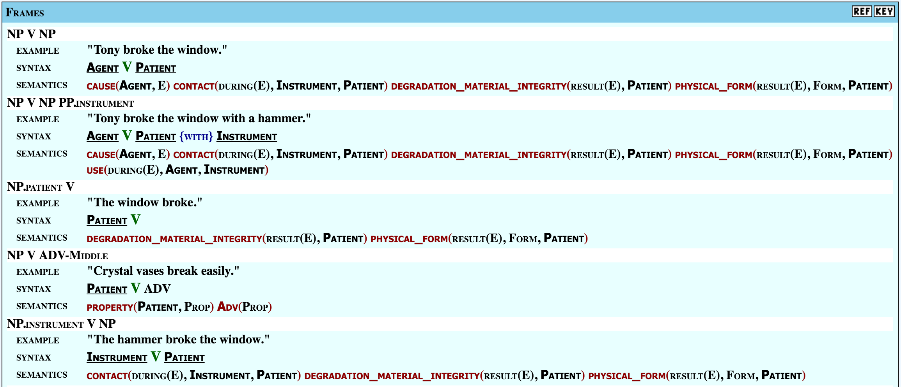
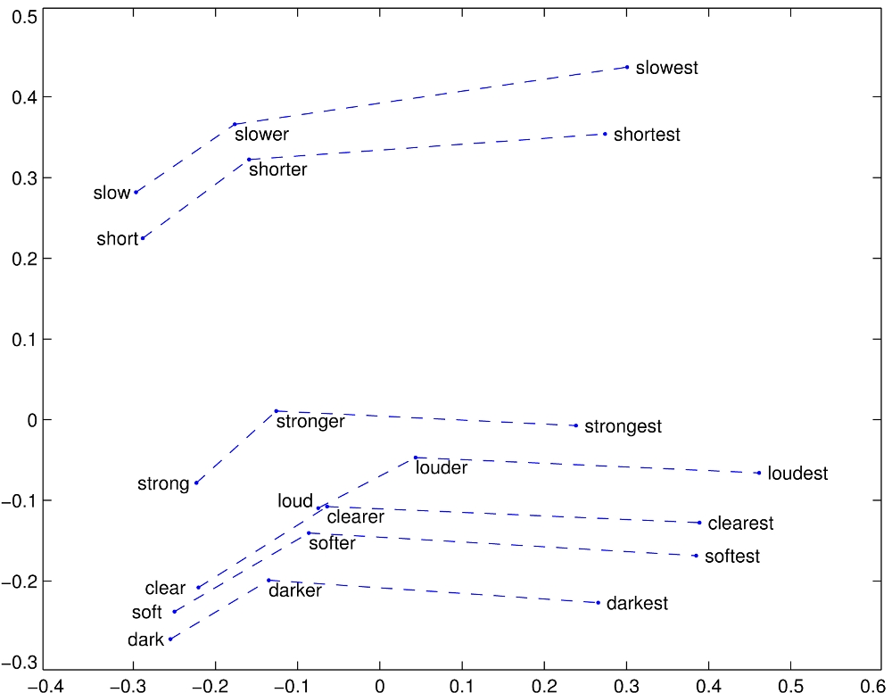
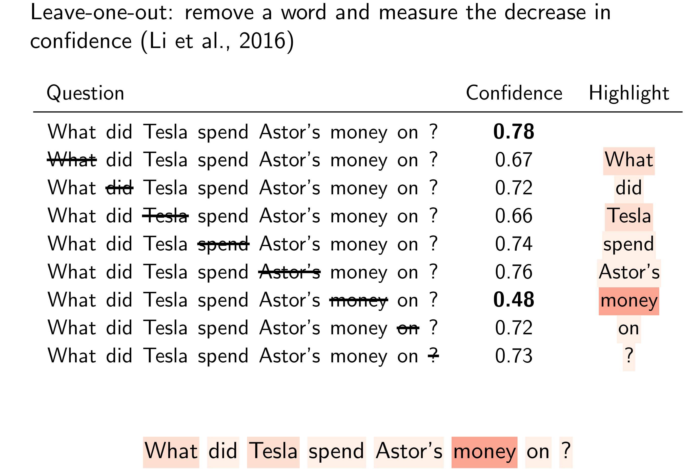
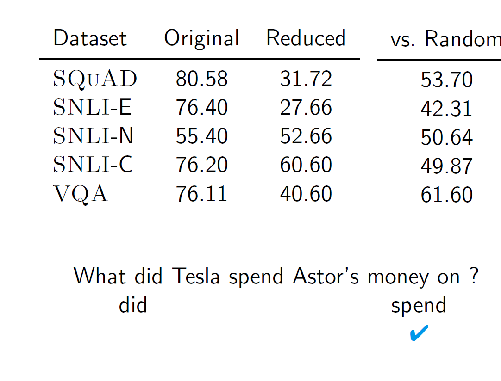
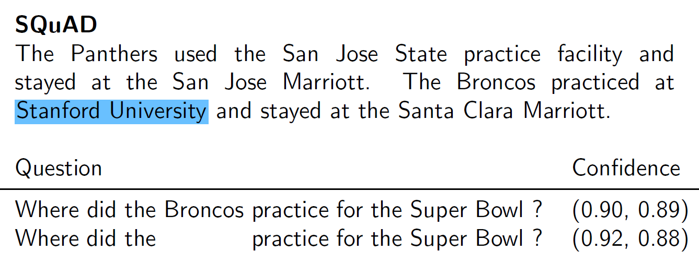
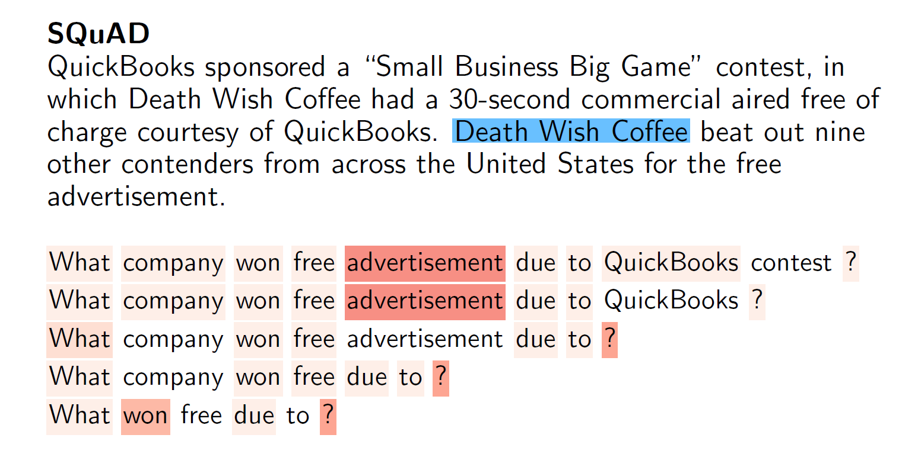
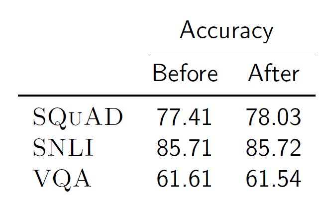
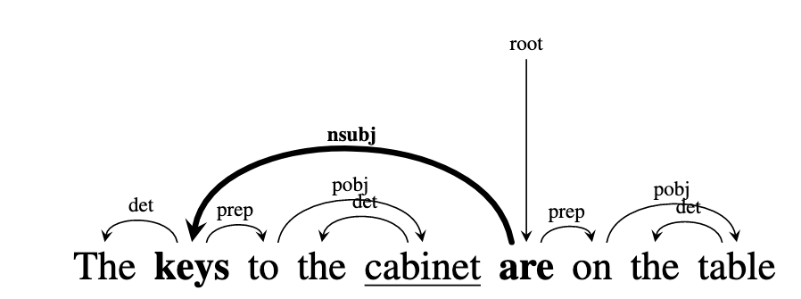

# Incremental Verb Prediction and What We Can Learn from Machine Learning Errors

---
# Outline
- Accessible Introduction to Natural Language Processing
    - accessible to undergraduates
- Computational verb prediction in subject-object-verb languages
    - SOV-SVO Simultaneous machine translation
- Pathological errors in NLP systems
    - What do these say about what systems learn?
---
# What is Computational Linguistics?
- Can divide into overlapping areas
    - Natural Language Processing (NLP) and Human Language Technologies
        - Develop technologies that use or process human language.
        e.g., machine translation, text-to-speech, speech-to-text, web search, virtual assistants, question answering, etc.
    - Computational Study of Language
        - Study language with computational techniques and tools.
        e.g., corpus linguistics, annotation
---
# Examples of NLP/CL

---
# Examples of NLP/CL

---
# Examples of NLP/CL

---
# Examples of NLP/CL

---
# Examples of NLP/CL

---
# Examples of NLP/CL
Automatic Captioning

Image from [Microsoft Teams support site](https://support.microsoft.com/en-us/office/use-live-captions-in-a-teams-meeting-4be2d304-f675-4b57-8347-cbd000a21260)

---
# Problems in Comptuational Linguistics
 ## Syntactic Parsing

---
<!-- footer: "" -->

# Problems in Comptuational Linguistics
 ## Syntactic Annotation and Parsing
 VerbNet

---
<!-- footer: "Alvin Grissom II\nHaverford College" -->
# Language Modeling
- Answers question: What is the most probable next word?
    - Equivalently: How probable is a given sentence?
    - Fundamental to most common NLP tasks: translation, speech recognition, etc.

---

# Language Modeling
- Answers question: What is the most probable next word?
    - Equivalently: How probable is a given sentence?
    - Fundamental to most common NLP tasks: translation, speech recognition, etc.

---

# Language Modeling
- Answers question: What is the most probable next word?
    - Equivalently: How probable is a given sentence?
    - Fundamental to most common NLP tasks: translation, speech recognition, etc.
- What does it mean to say that one sentence is more probable than another?

---
# Language Modeling
- Answers question: What is the most probable next word?
    - Equivalently: How probable is a given sentence?
    - Fundamental to most common NLP tasks: translation, speech recognition, etc.

 What does it mean to say that one sentence is more probable than another? 
    - Language modeling attempts to answer this by using a **corpus** (pl. corpora) of data.

---
# Language Modeling
- By using corpora, we can estiamte the probability of the next word in a sentence or phrase.
- Ex: The word "science" is more likely to follow the word "computer" than "kumquat."
- We can use this for autocompletion.
    - In realty, modern autocompletion also uses other information, such as a profile of your recent behavior, location, etc. to inform suggestions.

---
# Language Modeling
- Also works for spelling.

---
# Brief History

- Computational linguistics as a field was born in the 1950's with the Georgetown-IBM experiments in machine translation.
    - Nearly all "AI," including NLP, was rule-based.
- In 1990, a successful approach to machine translation involving Bayesian probability changed the field.

    - Statistical (data-driven) **machine learning** approaches dominated for decades.
- Currently, most NLP research uses machine learning, especially "deep learning."

---

# Machine Learning
- **Machine learning** is an area of computer science concerned with algorithms that allow computers to "learn" from observation.
    

--- 
# Machine Learning 
- **Machine learning** is an area of computer science concerned with algorithms that allow computers to "learn" from observation.
    - For example, learning to **align** words in two different languages by observing many translated sentences.
    

---

# Machine Learning 
- **Machine learning** is an area of computer science concerned with algorithms that allow computers to "learn" from observation.
    - Another example: SPAM filtering.
    - Show algorithm examples of SPAM and NOT SPAM and it will determine which features are useful for classifying them.
    

---
# Machine Learning
- ML is a kind of function approximation.
    - We care about **generalization** more than fitting the training data.
    - In supervised learning, we show the algorithm some examples with labels (SPAM, NOT SPAM), and it then tries to label new, unseen instances based on what it has learned.
    - It's trying to learn a function.
    $$
    f(\text{email}) = \{\text{{spam, not-spam}}\}
    $$

---
# Machine Learning
- **Neural networks** are popular in machine learning.
- They're often able to complete more complex tasks than other kinds of models
        i.e., they can learn more complex, composite functions: 
        $f(g(h(\text{email})))=\{\text{spam}, \text{not-spam}\}$
- Each node in a neural network is a classifier.
        

    

---
# Distributional Semantics
- **Word embeddings** attempt to calculate similarity between words in a corpus.
    - Based on the **distributional hypothesis**.
        - Similar words tend to occur in similar contexts.
    - Map words to a mathematical vector space with machine learning.
    - Similar words should be near each other in the vector space.
    - Can study correlations with human judgments.
    - See [embedding projector](https://projector.tensorflow.org/).
    
---
# Distributional Semantics
Superlative relations
Image from [GloVe Embeddings](https://nlp.stanford.edu/projects/glove/).

---

# Distributional Semantics
City and zip code
Image from [GloVe Embeddings](https://nlp.stanford.edu/projects/glove/).

---

# Distributional Semantics

Image from [GloVe Embeddings](https://nlp.stanford.edu/projects/glove/).

---
# Distributional Semantics
Diachronic changes in meaning

Image from [Hamilton  et al.](https://nlp.stanford.edu/projects/histwords/)

---
# Distributional Semantics
 Analogical reasoning
 
Image from [Mikolov et al. (2013)](https://aclanthology.org/N13-1090.pdf).

---

# Distributional Semantics
- Word embeddings are used in almost every modern neural network on text data.
- Question: Whose meaning is being captured?

---

# Distributional Semantics
- Word embeddings are used in almost every modern neural network on text data.
- Question: Whose meaning is being captured?
- Word embeddings are known to encode biases from the data.
    - Embeddings can encode dubious relations.
    The same algorithm that find:
    $$
    \text{man} - \text{woman} \approx \text{king} - \text{queen}
    $$
    also finds
    $$
    \text{man} - \text{woman} \approx \text{computer programmer} - \text{homemaker}
    $$
    [(Bolukbasi et al., 2016)](https://proceedings.neurips.cc/paper/2016/file/a486cd07e4ac3d270571622f4f316ec5-Paper.pdf)

---

# Distributional Semantics
- Word embeddings are used in almost every modern neural network on text data.
- Question: Whose meaning is being captured?
- Word embeddings are known to encode biases from the data.
    - Embeddings can encode dubious relations.
    The same algorithm that find:
    $$
    \text{man} - \text{woman} \approx \text{king} - \text{queen}
    $$
    also finds
    $$
    \text{man} - \text{woman} \approx \text{computer programmer} - \text{homemaker}
    $$
    [(Bolukbasi et al., 2016)](https://proceedings.neurips.cc/paper/2016/file/a486cd07e4ac3d270571622f4f316ec5-Paper.pdf)

--- 
# Incremental Language Processing
---
# Incremental Language Processing
## Simultaneous Machine Translation

- Translation of human language is difficult and in some ways ill-defined.
- Interpreting in *real-time* is even more difficult.
- Simultaneous machine translation attempts to tackle this task.
    - Unless the machine backtracks constantly, machine must decide when to translate each segment.

---
# Incremental Language Processing
## Simultaneous Machine Translation
- What about simultaneous translation between languages with different respective word orders?
    - Subject-object-verb (SOV) to subject-verb-object (SVO) simultaneous machine translation.
    - Can't translate sentence without main verb.

---
# Incremental Language Processing
## SOV-SVO simultaneous machine translation.
- Grissom et al. (2014, 2017) showed that we could language model-based use verb predictions to improve SOV-SVO statistical simultaneous machine translation.
    - Sentence-final verb prediction is hard.

---
# How hard is verb prediction for humans?

- Humans predict final verbs (e.g., Levy and Keller, 2013;
Momma et al., 2015; Chow et al., 2015).
    - But how well?
- Grissom et al. (2016) used multiple choice experiments to investigate.

---
# How hard is verb prediction for humans?

- We ask native Japanese speakers to predict the verb under two conditions:
  - Only final verb is missing.
  - Sentence is truncated randomly.

---
# How hard is verb prediction for humans?

Randomly truncated sentences

---
# How hard is verb prediction for humans?

### Full context set
- Longer sentences harder to predict.
- Avg. accuracy 81.1%
- Density of case markers has significant effect.

---
# How hard is verb prediction for machines?
- $n$-gram models don't work well
    - designed for sequential prediction

---
# Linear Classifier Verb Prediction
### Japanese
- Explicit case marker information helps
- Greatly outperforms $n$-gram language model.

---
# Linear Classifier Verb Prediction
### German
- Explicit case marker information helps

---

# Logistic Regression Verb Prediction

---

# Logistic Regression Verb Prediction

---
# Deep Learning Verb Prediction 

- In Li et al. (2020), we examined several recurrent neural networks for classifying the final verb given incomplete sentences.

---
# Deep Learning Verb Prediction
#### Results
- Due to morphological richness, we normalize Japanese verbs.
- For German, we lemmatize and allowed synonym matching with a dictionary.

---
# Neural Verb Prediction Accuracy

---
# Neural Verb Prediction 

- When the most recent token is a case marker, there are large disparities in accuracy, depending on the marker.

---
# Neural Verb Prediction

- By examining attention weights, we can see that sometimes the case markers are being focused on, in this case the genitive marker.
- Seems to mostly focus on most recent token.
    - Can be difficult to interpret attention weights (Jain et al., 2019)
---
# Summary
- Incremental verb selection is still unsolved.
- Low accuracy, even on simplified problem.
- Sometimes, model seems to be using information a human might use (e.g., case markers.)

# Model Overconfidence
- Well-documented adversarial attacks in computer vision (Goodfellow et al., 2014)

 
Goodfellow, Ian J., Jonathon Shlens, and Christian Szegedy. "Explaining and harnessing adversarial examples." (2014).

---
### Highlighting Important Words
- One common interpretation technique is to highlight **important words.**
- Remove each word, one at a time, and observe the chane in confidence.
    - Slow
   - We can approximate with input gradient (Simonyan et al., 2014)

Shi Feng, Eric Wallace, Alvin Grissom II, Mohit Iyyer, Pedro Rodriguez, Jordan Boyd-Graber "Pathologies of neural models make interpretations difficult." EMNLP (2018).

---
- One common interpretation technique is to highlight **important words.**
- Remove each word, one at a time, and observe the chane in confidence.
    - Slow
   - We can approximate with input gradient (Simonyan et al., 2014)

Shi Feng, Eric Wallace, Alvin Grissom II, Mohit Iyyer, Pedro Rodriguez, Jordan Boyd-Graber "Pathologies of neural models make interpretations difficult." EMNLP (2018).

  

---

# Input Reduction

What if we removed **unimportant words** without changing predictions?

---

# Model Overconfidence

__
  
---

---
# All Examples Drastically Reduced

- We can consistently reduce examples to very short lengths without changing the prediction.

---

 Confidence remains high on reduced examples.

 
 
---

# Humans Confused by Reduced Inputs
- Reduced inputs appear random to humans.

---

 

- After first reduction step, already rubbish, but confidence remains high.

---
# How did this happen?

Impliict bag-of-words assumption.

---

# Mitigation
- Can this be mitigated?
   * Yes! Modify objective function to co-optimize for high entropy on reduced examples.
   * Ideally, we want a model to say "I don't know" when it doesn't know (uniform distribution of confidences)

   $$
    \sum_{(\mathbf{x},y)}\log f(y|\mathbf{x}) + \lambda\sum_{\tilde{x}\in \tilde{\mathcal{X}}}\mathbb{H}(f(y|\tilde{\mathbf{x}})),
   $$
   where $\tilde{\mathcal{X}}$ is the set of reduced training examples.

---
   

---

- Accuracy maintained with new model.

---

- Length of reduced examples increases, making them less likely to confuse humans.
---

- Input reduction leads to more meaningful examples after regularization.
---

# Summary
- Neural models are overconfident, making interpretations difficult.
    * Poor uncertainty estimates from training.
    * Entropy regularization helps to mitigate.
    
---

# Other Examples of Pathological Behaviors

- Machine Translation
    - "hallucinations" (Lee at al., 2018)

From The Guardian (2017).

---

# Other Examples of Pathological Behaviors

- Machine Translation
    - "hallucinations" (Lee at al., 2018)

From The Guardian (2017).

---

# Other Examples of Pathological Behaviors

- Machine Translation
    - "hallucinations" (Lee at al., 2018)
- Question Answering (Feng et al. 2018)
- Vision (Goodfellow et al., 2017)

---

# Other Examples of Pathological Behaviors

- Machine Translation
    - "hallucinations" (Lee at al., 2018)
- Question Answering
- Vision (Goodfellow et al., 2017)
- These errors are distinct from most forms of "bias," which describe general tendencies.
From The Intercept (2016).

---
# Incremental Language Processing
- Humans process language incrementally.
- Humans predict input before it's observed.
- Studied in various frameworks (entropy, syntactic and semantic constraints, N400, P600, etc.)

---

# Linguistic Experiments on Machine Learning Systems
- Linguists and cognitive scientists often perform carefully designed experiments to learn about human language use.
- Some computational linguists run these same experiments on ML models.

---

# Linguistic Experiments on Machine Learning Systems
- Linguists and cognitive scientists often perform carefully designed experiments to learn about human language use.
- Some computational linguists run these same experiments on ML models.
    - For example, what does a nueral network learn about subject-verb agreement?
  
     "The **keys** to the cabinet **are** on the table." ([Linzen et al., 2016](https://direct.mit.edu/tacl/article/doi/10.1162/tacl_a_00115/43378/Assessing-the-Ability-of-LSTMs-to-Learn-Syntax))
    - Carefully designed, targeted experiments can tell us what these models do and do not learn.
        - Do they learn actual linguistic structure or just surface level relations?
          ([Linzen et al., 2016](https://direct.mit.edu/tacl/article/doi/10.1162/tacl_a_00115/))

---

# Examining Errors

- We can learn a lot by examining the errors that systems make, just as in humans.
- We know that neural network-based classifiers perform well on some tasks.
    - But we also know that they can sometimes make counterintuivie and unpredictable mistakes.
- How do systems cope with unexpected changes in input?

---
# Neural Network Brittleness
- Neural networks are impressive but brittle and their decision functions are difficult to understand.
- We can design experiments to determine what the networks do or do not learn.

---
# Examining Errors

- Most NLP work is currently focused on increasing accuracy.

- I'm more interested in the mistakes.

