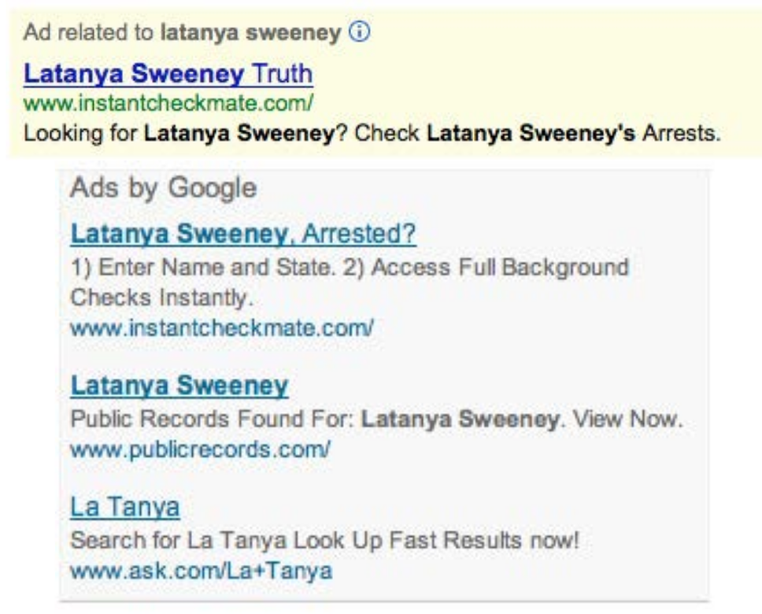

# Thinking about How NLP is Used to Serve Power: Current and Future Trends 

Alvin Grissom II
Haverford College

---

# Outline
* About me and my recent work
* Context
* Bias
  - An innocuous example (from our own work)
  - More sinister examples
* NLP and ML for social control and domination
* Fixes
* Final Thoughts

---
# About Me and My Recent Work
- Assistant Professor of Computer Science at undergraduate liberal arts college.
- Worked on first reinforcement learning system for simultaneous machine translation (Grissom et al., 2014), incremental SOV final verb prediction (Grissom et al, 2016; Li et al., 2020).
- Worked 
- Recently interested in pathological errors in NLP/ML models (Feng et al., 2018; Shi et al., 2022).
 

---

# Goal of this talk
## Have a conversation; ask questions

1. Whose interests does NLP serve, and who is setting the agenda?
2. Will all reserach ultimately serve power?
3. How does one work in a field without being co-opted by it?

---

# Model Overconfidence
Well-documented adversarial attacks in computer vision (Goodfellow et al., 2014)

---
# Model Overconfidence
- What happens if we remove the *unimportant* words without changing the prediction? (Feng et al., 2018)

  
---

# Model Overconfidence
- What happens if we remove the *unimportant* words without changing the prediction?

  
---

# Model Overconfidence

__
  

---
# Model Overconfidence
- Can this be mitigated?
   * Yes! Modify objective function to co-optimize for high entropy on reduced examples.
   * Ideally, we want a model to say "I don't know" when it doesn't know (uniform distribution of confidences)
   

Shi Feng, Eric Wallace, Alvin Grissom II, Mohit Iyyer, Pedro Rodriguez, Jordan Boyd-Graber "Pathologies of neural models make interpretations difficult." EMNLP (2018).

  
---
# Severe Machine Translation Errors
- In Shi et al. (2022), we wanted to know what the simplest way to 
cause severe neural MT errors.
    - Delete a single character from the input

Ruikang Shi, Alvin Grissom II, and Duc Minh Trin. "Rare But Severe Errors in Neural Machine Translation: An Empirical Study on Chinese and English." COLING (2022)

---
# Severe Machine Translation Errors
- In Shi et al. (2022), we wanted to know what the simplest way to 
cause severe neural MT errors.
- Delete a single character from the input

Ruikang Shi, Alvin Grissom II, and Duc Minh Trin. "Rare But Severe Errors in Neural Machine Translation: An Empirical Study on Chinese and English." COLING (2022)

---
# Severe Machine Translation Errors 
- In Shi et al. (2022), we wanted to know what the simplest way to 
cause severe neural MT errors.
- Delete a single character from the input
- Look at "good" examples (BLEU > .5) and see which ones drop to BLEU < .1 after deletion.

Ruikang Shi, Alvin Grissom II, and Duc Minh Trin. "Rare But Severe Errors in Neural Machine Translation:" COLING (2022)

---
# Severe Machine Translation Errors

Ruikang Shi, Alvin Grissom II, and Duc Minh Trin. "Rare But Severe Errors in Neural Machine Translation: An Empirical Study on Chinese and English." COLING (2022)

---
# Severe Machine Translation Errors

Ruikang Shi, Alvin Grissom II, and Duc Minh Trin. "Rare But Severe Errors in Neural Machine Translation: An Empirical Study on Chinese and English." COLING (2022)

---

---
# Deleterious Bias in NLP

---
# Obvious Case: Using Biased Data
* Algorithms learn *prejudice*, not merely "bias"
* Caliskan et al. (2017) found "every linguistic bias documented in psychology [they] looked for" in Glove embeddings.
 * Typical European-American names associated with pleasant words; black American names associated with negative words
 * Typical names for women associated with arts; those for men associated with science
 

__
  
Caliskan, Aylin, Joanna J. Bryson, and Arvind Narayanan. "Semantics derived automatically from language corpora contain human-like biases." Science 356.6334 (2017): 183-186.

---
* Word embeddings ubiquitous in NLP
  * Gender bias in machine translation
  * Headline generation
 * Related: Amazon job interview selection algorithm 
       
  
 Image: "Amazon scraps secret AI recruiting tool that showed bias against women." Reuters, October, 2018

---

# Obvious Case: Using Biased Data

* In *Algorithms of Oppression*, Safiya Noble examines bias and prejudice in popular search algorithms from a black feminist perspective
* Autocompletion (shown on the cover) only scratches the surface

---
# Obvious Case: Using Biased Data
 
- Well-documented that US media smear black victims of white violence and police violence with irrelevant information or false information leaked by the police.
- Ex: Timothy Caughman was murdered by a white supremacist
> Coughman lived in transitional housing on West 36th Street that serves people with HIV/AIDS. Praxis Housing Initiatives holds a contract with the city. **He has 11 prior arrests, including for marijuana, assault, resisting arrest and menacing.**
> 
__

1. "Black Man Stabbed to Death by White Supremacist—Then Smeared by Media" by Adam Johnson, Fairness and Accuracy in Reporting (FAIR)  March 22, 2017
2. Quote from New York Daily News, March 22, 2017

---
# Obvious Case: Using Biased Data
 >   Caughman, **who has 11 prior arrests**, walked for about a block after the stabbing and staggered into the Midtown South Precinct, looking for help. He died hours later after being rushed to a nearby hospital.
**Police sources said the career criminal** was refusing to talk to police about the incident and **acting combative before his death.**
__

1. "Black Man Stabbed to Death by White Supremacist—Then Smeared by Media" by Adam Johnson, Fairness and Accuracy in Reporting (FAIR)  March 22, 2017
2. Quote from New York Post, March 21, 2017

---
# Obvious Case: Using Biased Data

* Headline automatically generated
  * Headline masterfully regurgitates anti-black portrayal of shooting victims
__
 Noble, Safiya Umoja. *Algorithms of Oppression: How search engines reinforce racism.* NYU Press, 2018.

---
# Obvious Case: Using Biased Data
In 2016, when users searched "three Black teenagers," they were shown mugshots; "three white teenagers" returned smiling youths; "three Asian teenagers" returned "scantily clad girls and women" (Benjamin, 2019)
__
Benjamin, Ruha. Race After Technology: Abolitionist Tools for the New Jim Code. John Wiley & Sons, 2019.

---
# Less Obvious: Incentive Structures

"Google's monopoly status, coupled with its algorithmic practices of biasing information toward the interests of the neoliberal capital and social elites in the United States, has resulted in a provision of information that purports to be credible but is actually a reflection of advertising interests."
 
__

1. Noble, Safiya Umoja. *Algorithms of Oppression: How search engines reinforce racism.* NYU Press, 2018.

---
# Less Obvious: Incentive Structures

__

1. BuzzFeed News, September 15, 2017
2. Ali, Muhammad, et al. "Discrimination through optimization: How Facebook's ad delivery can lead to skewed outcomes." arXiv preprint arXiv:1904.02095 (2019) 

---
# Incentive Structures
* Sweeny (2013) found that black identifying names were 25% more likely to  get an AdSense ad suggestive of an arrest record than white identifying names.

__
Sweeney, Latanya. "Discrimination in online ad delivery." arXiv preprint arXiv:1301.6822 (2013)
	
---

# Incentive Structures
* Benjamin (2019) notes that "the notion that tech bias is 'unintentional' or 'unconscious' obscures the reality -- that there is no way to create something without some intention and intended user in mind..."
> A former Apple employee...described his experience on a team that was developing speech recognition for Siri... As they worked on several English dialects, he asaked his boss: "What about African American English?" To which his boss responded: "Well, Apple products are for the premium market."

  
__
Benjamin, Ruha. Race After Technology: Abolitionist Tools for the New Jim Code. John Wiley & Sons, 2019.
	

---
# From Perverse Incentives to Social Control
Intentional or not, prejudice propagated by algorithms will always hurt already vulnerable populations the most.

---
# Social Control and Domination

* Benjamin (2019) describes "the New Jim Code" (a pun of Michelle Alexander's best-selling *The New Jim Crow*) as "the employment of new technologies that reflect and reproduce existing inequities but that are promoted and perceived as more objective or progressive than the discriminatory systems of a previous era."
	

__
  
Benjamin, Ruha. Race After Technology: Abolitionist Tools for the New Jim Code. John Wiley & Sons, 2019.

---
# Social Control and Domination

* My claim: technology has always been used for domination
* The language technologies we develop will enable surveillance and social control at both a scale **and** granularity never before possible in history
* Scientists and engineers have always been the handmaidens of empire and exploitation; now is no different
	

---
# Surveillance
- FBI and ICE use facial recognition for "law enforcement" (social control), as do police in France, China, Australia, and other countries.
- White males usually give lowest FMR (false match rate).
- People have been injured by police and arrested multiple times
- Amazon has pitched its Rekognition software to ICE
 </img>

 

The Intecept. *How Facial Recognition Can Ruin Your Life* October 13, 2016

---

# Surveillance
    
 > The NYPD acquired IBM’s video analytics software as one part of the Domain Awareness System, a shared project of the police department and Microsoft that centralized a vast web of surveillance sensors in lower and midtown Manhattan — including cameras, license plate readers, and radiation detectors — into a unified dashboard. IBM entered the picture as a subcontractor to Microsoft subsidiary Vexcel in 2007, as part of a project worth $60.7 million over six years....
</img>
>In New York, the terrorist threat “was an easy selling point,” recalled...an IBM researcher who worked on the initial NYPD video analytics installation. “You say, ‘Look what the terrorists did before, they could come back, so you give us some money and we’ll put a camera there.”
  __ 

The Intecept. *IBM Used NYPD Surveillance Footage to Develop Technology That Lets Police Search by Skin Color*. September 6, 2018

---

# Surveillance

* San Francisco just banned the use of facial recognition surveillance after a study showed that it disproportionately affected people of color and women
* California is considering a state-wide ban
* The MIT-based Algorithimc Justice League, led by Joy Buolamwini, sent a letter of concern to Jeff Bezos about its Rekognition software

---

# Surveillance

- Amazon also provides cloud infrastructure to the CIA, via a $600 million deal.
- Jeff Bezos sits on the Pentagon's  Defense Innovation Advisory Board, along with former Google CEO Eric Schmidt, Instagram COO Marne Levine, LinkedIn Cofounder Reid Hoffman, and others.
 
---

# Surveillance
 

  * A classified NSA memo from 2006 describes technology to identiy people by their voices.
  > “There are microphones all around us all the time. We all carry around a microphone 24 hours a day, in the form of our cellphones. And we know that there are ways for the government to hack into phones and computers to turn those devices on.”
  
  -Trevor Timm, executive director of the Freedom of the Press Foundation

__
  
---

---
# Surveillance
 > ... Nuance, an industry leader, advertises to governments, military, and intelligence services “a country-wide voice biometric system, capable of rapidly and accurately identifying and segmenting individuals within systems comprising millions of voiceprints.” In 2014, the Associated Press reported that Nuance’s technology had been used by Turkey’s largest mobile phone company to collect voice data from approximately 10 million customers. 
  
  -Trevor Timm, executive director of the Freedom of the Press Foundation
  
  ---
  # Surveillance
 > By developing programs to automatically translate speech into text — what analysts called “Google for voice” — the [NSA] could use keywords and “selectors” to search, read, and index recordings that would have otherwise required an infinite number of human listeners to listen to them. 
 __
The Intercept. "Finding Your Voice", January 20, 2018 
  
  
  ---
 
  # History Lesson
  
- Under COINTELPRO, US government spied on, harrassed, and assassinated black and leftist activists
- FBI currently targeting "black identity extremists"
- What would they do with advanced NLP?

---

</img>

---
# Large Language Models, etc.

- Everyone is talking about GPT-3, Stable Diffusion, DALL-E, etc.
    - Interesting and impressive, but over-hyped
- My view: talk of sentience, consciousness, and rights of differentiable functions is a distraction. 
- If GPT-3, etc. were sentient (which they aren't), then the obvious ethical avenue would be to stop all development on it.
    - Avoids bigger questions about what is motivating this particular direction.

---

# Mitigation?
- Important, but often over-sold
- Be weary of the wrong kind of "fixing"
  * "[embracing] a racialized conception of 'problem people'"

> Racial fixes are better understood not as viruses but as part of the underlying code of the operating systems -- often developed as solutions to particular kinds of predicaments without sufficient awareness of the problems that they help produce and preserve.
> 
__
Benjamin, Ruha. Race After Technology: Abolitionist Tools for the New Jim Code. John Wiley & Sons, 2019.

---

# The Five Filters in Research

- The Five Filters were described by Herman and Chomsky in *Manufacturing Consent* to describe the ways in which thought control is exercised in a free society through the media.
1. Ownership
2. Advertising
3. The Media Elite
4. Flak
5. The Common Enemy
__
Herman, Edward S., and Noam Chomsky. Manufacturing consent: The political economy of the mass media. Random House, 2010.
---

# Final Thoughts

> There is a bias to what kinds of problems we think are important, what kinds of research we think are important, and where we think AI should go. If we don’t have diversity in our set of researchers, we are not going to address problems that are faced by the majority of people in the world. When problems don’t affect us, we don’t think they’re that important, and we might not even know what these problems are, because we’re not interacting with the people who are experiencing them.

-Timnit Gebru
__
Interview in MIT Technology Review, February 14, 2018

---

</img>
</img>

---

# Some Takeaways
- Research largely driven by corporations and military
  - Even if your country doesn't have a military, the US largely sets the agenda.
- Scientists are the handmaidens of social control and oppression of marginalized groups, and NLP is at the forefront of it
  * Universities should challenge this power, not serve it
- "Window dressing" diversity won't change anything.
- What is considered legitimate research is implicitly racialized
- Most in positions of authority in research are from dominant colonial societies built off the the exploitation of people who are now struggling for acceptance
- This talk has been US-centric, but the principles, I believe, largely generalize.

---

# Some Takeaways
- We think of "naturally occurring data" as a natural resource.
- If so, then our current relationship to data is **extractive**
  * What are the implications of this?
  
---
# My view
- Small decisions matter.
- Attacking people isn't going to solve this; systems are supra-individual.
- It's an interesting challenge to work in a field with so much power and so many perverse incentives while striving for integrity.
- Being informed doesn't have to mean being constantly angry.
    - Really, it doesn't.
    - I promise.

 

---
# Recommended Reading

- Race After Technology: Abolitionist Tools for the New Jim Code, by Ruha Benjamin 
- Algorithms of Oppression: How Search Engines Reinforce Racism, by Safiya Noble 
- Weapons of Math Destruction: How Big Data Increases Inequality and Threatens Democracy, by Cathy O'neil
- Automating Inequality: How High-tech Tools Profile, Police, and Punish the Poor, by Virginia Eubanks
- Habeas Data: Privacy vs. the Rise of Surveillance Tech, by Cyrus Farivar

# Questions?
