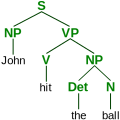
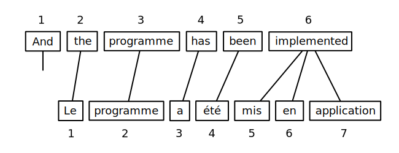
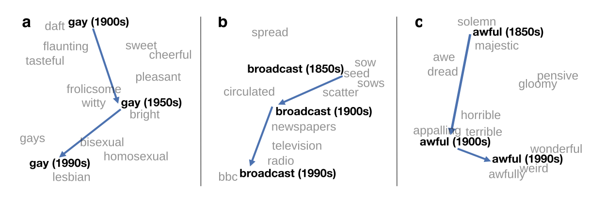
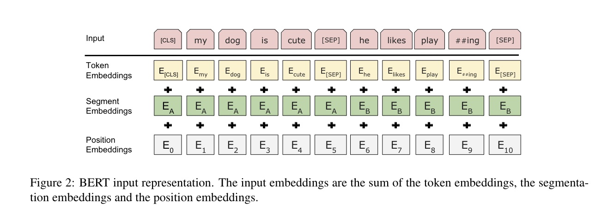
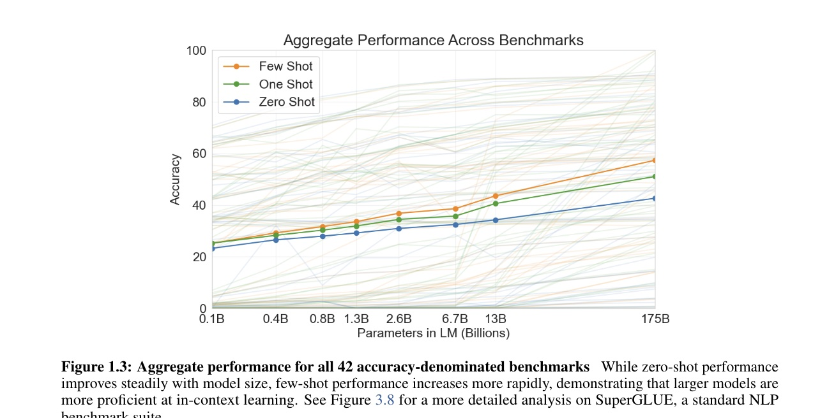
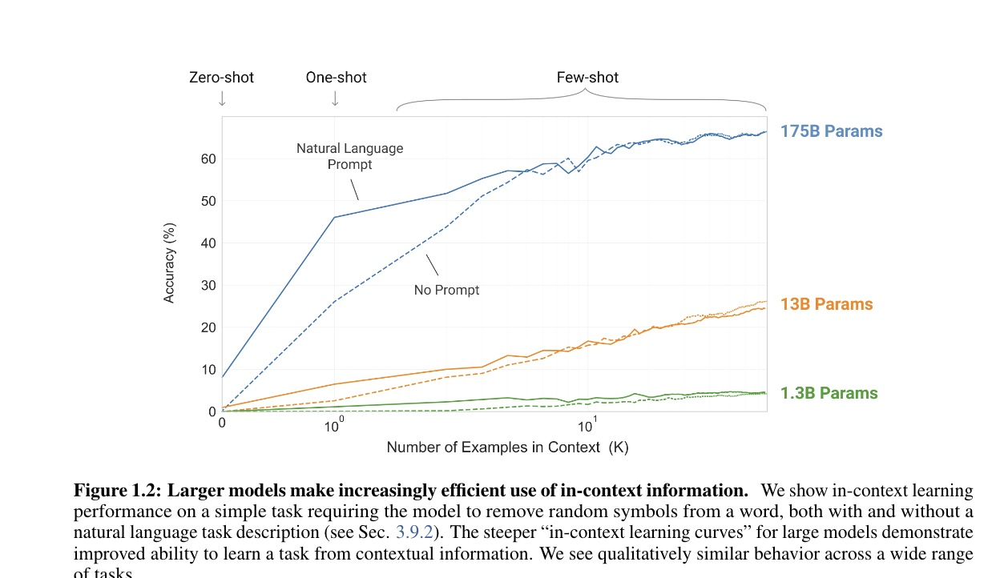
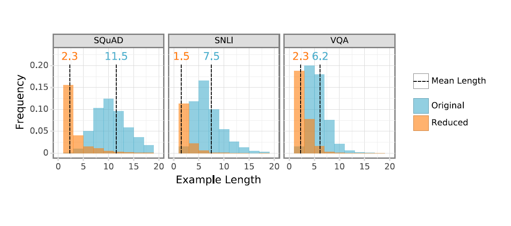
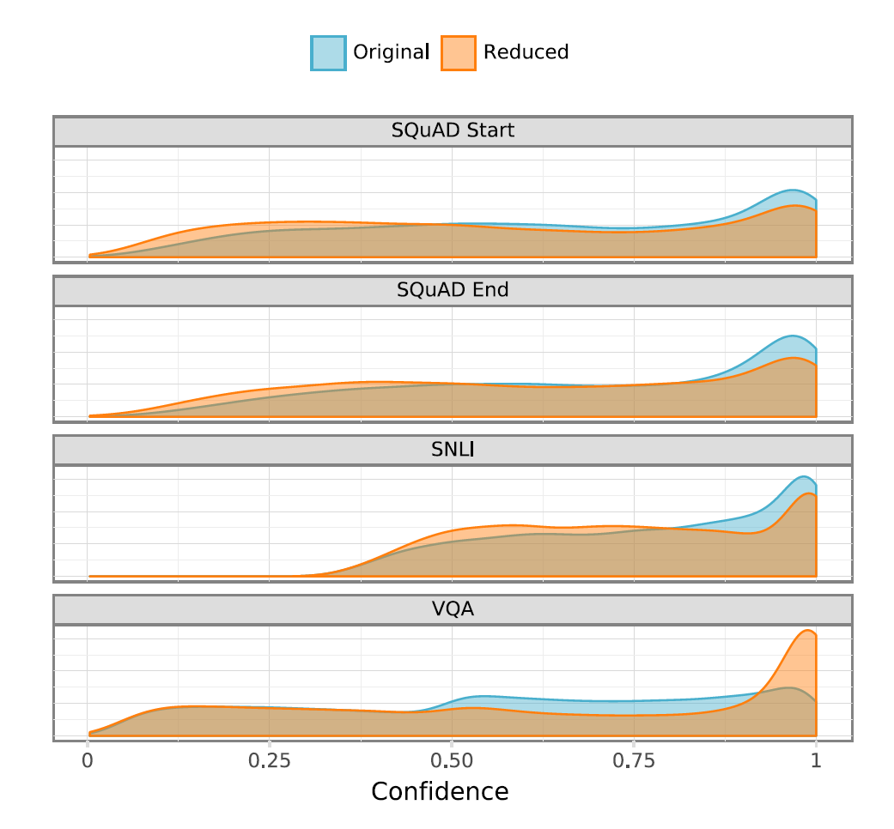

# Gentle Introduction to Computational Linguistics
---
# What is Computational Linguistics?
- Can divide into overlapping areas
    - Natural Language Processing (NLP) and Human Language Technologies
        - Develop technologies that use or process human language.
        e.g., machine translation, text-to-speech, speech-to-text, web search, virtual assistants, question answering, etc.
    - Computational Study of Language
        - Study language with computational techniques and tools.
        e.g., corpus linguistics, annotation
---
# Examples of NLP/CL

---
# Examples of NLP/CL

---
# Examples of NLP/CL

---
# Examples of NLP/CL

---
# Examples of NLP/CL

---
# Examples of NLP/CL
Automatic Captioning

Image from [Microsoft Teams support site](https://support.microsoft.com/en-us/office/use-live-captions-in-a-teams-meeting-4be2d304-f675-4b57-8347-cbd000a21260)

---
# Problems in Comptuational Linguistics
 ## Syntactic Parsing

---
<!-- footer: "" -->

# Problems in Comptuational Linguistics
 ## Syntactic Annotation and Parsing
 VerbNet

---
<!-- footer: "Alvin Grissom II\nHaverford College" -->
# Language Modeling
- Answers question: What is the most probable next word?
    - Equivalently: How probable is a given sentence?
    - Fundamental to most common NLP tasks: translation, speech recognition, etc.

---

# Language Modeling
- Answers question: What is the most probable next word?
    - Equivalently: How probable is a given sentence?
    - Fundamental to most common NLP tasks: translation, speech recognition, etc.
- Question for students: How many possible sentences are there in English?

---

# Language Modeling
- Answers question: What is the most probable next word?
    - Equivalently: How probable is a given sentence?
    - Fundamental to most common NLP tasks: translation, speech recognition, etc.
- Question for students: How many possible sentences are there in English?
- Another question: What does it mean to say that one sentence is more probable than another?

---
# Language Modeling
- Answers question: What is the most probable next word?
    - Equivalently: How probable is a given sentence?
    - Fundamental to most common NLP tasks: translation, speech recognition, etc.
- Question for students: How many possible sentences are there in English?
- Another question: What does it mean to say that one sentence is more probable than another? 
    - Language modeling attempts to answer this by using a **corpus** (pl. corpora) of data.

---
# Language Modeling
- By using corpora, we can estiamte the probability of the next word in a sentence or phrase.
- Ex: The word "science" is more likely to follow the word "computer" than "kumquat."
- We can use this for autocompletion.
    - In realty, modern autocompletion also uses other information, such as a profile of your recent behavior, location, etc. to inform suggestions.

---
# Language Modeling
- Also works for spelling.

---
# Brief History

- Computational linguistics as a field was born in the 1950's with the Georgetown-IBM experiments in machine translation.
    - Nearly all "AI," including NLP, was rule-based.
- In 1990, a successful approach to machine translation involving Bayesian probability changed the field.

    - Statistical (data-driven) **machine learning** approaches dominated for decades.
- Currently, most NLP research uses machine learning, especially "deep learning."

---

# Machine Learning
- **Machine learning** is an area of computer science concerned with algorithms that allow computers to "learn" from observation.
    

--- 
# Machine Learning 
- **Machine learning** is an area of computer science concerned with algorithms that allow computers to "learn" from observation.
    - For example, learning to **align** words in two different languages by observing many translated sentences.
    

---

# Machine Learning 
- **Machine learning** is an area of computer science concerned with algorithms that allow computers to "learn" from observation.
    - Another example: SPAM filtering.
    - Show algorithm examples of SPAM and NOT SPAM and it will determine which features are useful for classifying them.
    

---
# Machine Learning
- ML is a kind of function approximation.
    - In one kind of ML, show the algorithm some examples with labels (SPAM, NOT SPAM), and then tries to label new, unseen instances based on what it has learned.
    - It's trying to learn a function
    $$
    f(\text{email}) = \{\text{{SPAM, NOT SPAM}}\}
    $$

---
# Machine Learning
- **Neural networks** are popular in machine learning.
    - They're often able to complete more complex tasks than other kinds of models
        i.e., they can learn more complex functions.
        

    - The more complex neural networks are called "deep."

---
# Distributional Semantics
- **Word embeddings** attempt to calculate similarity between words in a corpus.
    - Based on the **distributional hypothesis**.
        - Similar words tend to occur in similar contexts.
    - Map words to a mathematical vector space with machine learning.
    - Similar words should be near each other in the vector space.
    - Can study correlations with human judgments.
    - See [embedding projector](https://projector.tensorflow.org/).
    
---
# Distributional Semantics
Superlative relations
Image from [GloVe Embeddings](https://nlp.stanford.edu/projects/glove/).

---

# Distributional Semantics
City and zip code
Image from [GloVe Embeddings](https://nlp.stanford.edu/projects/glove/).

---

# Distributional Semantics

Image from [GloVe Embeddings](https://nlp.stanford.edu/projects/glove/).

---
# Distributional Semantics
Diachronic changes in meaning

Image from [Hamilton  et al.](https://nlp.stanford.edu/projects/histwords/)

---
# Distributional Semantics
 Analogical reasoning
 
 Image from [Mikolov et al. (2013)](https://aclanthology.org/N13-1090.pdf).

---

# Distributional Semantics
- Word embeddings are used in almost every modern neural network on text data.
- Question: Whose meaning is being captured?

---

# Distributional Semantics
- Word embeddings are used in almost every modern neural network on text data.
- Question: Whose meaning is being captured?
- Word embeddings are known to encode biases from the data.
    - Embeddings can encode dubious relations.
    The same algorithm that find:
    $$
    \text{man} - \text{woman} \approx \text{king} - \text{queen}
    $$
    also finds
    $$
    \text{man} - \text{woman} \approx \text{computer programmer} - \text{homemaker}
    $$
    [(Bolukbasi et al., 2016)](https://proceedings.neurips.cc/paper/2016/file/a486cd07e4ac3d270571622f4f316ec5-Paper.pdf)

---

# Distributional Semantics
- Word embeddings are used in almost every modern neural network on text data.
- Question: Whose meaning is being captured?
- Word embeddings are known to encode biases from the data.
    - Embeddings can encode dubious relations.
    The same algorithm that find:
    $$
    \text{man} - \text{woman} \approx \text{king} - \text{queen}
    $$
    also finds
    $$
    \text{man} - \text{woman} \approx \text{computer programmer} - \text{homemaker}
    $$
    [(Bolukbasi et al., 2016)](https://proceedings.neurips.cc/paper/2016/file/a486cd07e4ac3d270571622f4f316ec5-Paper.pdf)

---
# Neural Networks
- "Neural networks" are complex functions used to make a prediction.
    - Each "neuron" (circle) is a miniature, simpler machine learning model.
    - Simplest NNs have an input layer $\mathbf{x}$, one or more "hidden layers" $h_i$, and an output layer producing output $\hat{y}$.
$$
\hat{y} = f(g(h(\mathbf{x})))
$$

---
# Neural Networks
$$
\hat{y} = f(g(h(\mathbf{x})))
$$

- They don't really work like the brain. 
    - If it helps, call them "successive matrix multiplications."
- Deep learning started taking off around 2014-2015.

---
# "Generative" Machine Learning
- We can have language models based on neural networks instead of pure statistics.
    - "neural language models" are very good next-word predictors
- Most successful approach is called a "transformer."

---

# Deep Learning for Language Modeling
- As with statistical methods, use prior context to predict next word.
- Word embeddings are used to learn inter-relationships between words.
- The more data, the better the predictions
- The better the model architecture, the better the predictions.

---
# Transformers

- **Transformers** are the state of the art in language modeling.
- Transformers allow for arbitrarily long prior context for predicting the next word.
- Use **attention mechanism** to capture relationships between words.
- Benefit from huge amounts of data.

---
# Transformaers
### Attention Mechanism (Vaswani et al., 2017)

---
# Large Language Models 
- Transformers are the basis of **language language models** (LLMs).
    - Started with BERT.
        - Later: RoBERTa, ERNIE, KERMIT, Muppet, ELMo, Rosita, Big BIRD, GPT-2, etc.
        - More recently: GPT Neo, GPT-3, Flan, etc.

---
# BERT

- Transformer-based model
- Paper cited over 60,000 times since 2018.
    - Using BERT as a basis for "pre-training" broke a huge number of NLP benchmarks.
    - Basic training procedure:
1. **Pre-train** model on several general tasks using a huge amount of data
2. **Fine-tune** model for specific task, using pre-trained model as a basis.

---
# BERT Pre-training

Train to do the following:

1. Randomly hide words and train model to predict them.
2. Predict the next sentence.
    - Show model true next sentence and random sentence and have it pick one.

- That's it.

---
### BERT

---
### BERT

---
### GPT-3 (Brown et al., 2020)
- 175 billion parameters
    - 10 times as many as previous models
    - Can perform many tasks after seeing a few examples

---
### GPT-3 (Brown et al., 2020)

---
# GPT-3

- Demonstrated **few-shot learning**
    - Pre-trained GPT-3 model can learn to do a task by seeing just a few examples.
        - Doesn't require updating model

---
# GPT-3

- Trained on Common Crawl dataset
    - nearly one trillion words

---
# GPT-3

---
# Model Overconfidence
- What happens if we remove the *unimportant* words without changing the prediction? (Feng et al., 2018)

__
Shi Feng, Eric Wallace, Alvin Grissom II, Mohit Iyyer, Pedro Rodriguez, Jordan Boyd-Graber "Pathologies of neural models make interpretations difficult." EMNLP (2018).

  
---

# Model Overconfidence
- What happens if we remove the *unimportant* words without changing the prediction? (Feng et al., 2018)

__
  
---

---
# All Examples Drastically Reduced

- We can consistently reduce examples to very short lengths without changing the prediction.

---

 Confidence remains high on reduced examples.

 
 
---

# Humans Confused by Reduced Inputs

---

# How did this happen?

 

- After first reduction step, already rubbish, but confidence remains high.
- Confidence is **not** the same as uncertainty.

---
# How did this happen?

- Implicit bag-of-words assumption.
