# Pathological Properties of Deep Learning Models: Some Cases in Language and Vision 

---
# Outline
- Self-introduction
- Accessible Introduction to Natural Language Processing
    - accessible to undergraduates
- Computational verb prediction in subject-object-verb languages
    - SOV-SVO Simultaneous machine translation
- Pathological errors in NLP systems
    - What do these say about what systems learn?
---

---
# Self-Introduction
- Associate Professor of Computer Science at Haverford College (near Philadelphia, Pennslvania, USA) 
    - Undergraduate liberal arts college
    - Visiting Scholar, University of Tokyo Miyao Lab
- Computational linguist
- Ph.D. (2017) in Computer Science from University of Colroado Boulder with Jordan Boyd-Graber

---
# Self-Introduction

- Currently interested in:
    - statistical/computational epistemology
        - What (if anything) do models tell us about what they're (supposedly) modeling?
    - evaluation
        - Related: How can we better evaluate (without importing broken paradigms from other fields)
     - generalization
        - Do these models generalize or just seem appear to?
    - pathologies in models (today's talk)
        - Unexpected behaviors of learned models.

---
# Pathologies in Natural Language Processing
 - Question answering
 - Machine translation

---
# Pathologies in Natural Language Processing
 - **Question answering**
 - Machine translation

---
# Machine Translation

---
# Model Overconfidence
- Well-documented adversarial attacks in computer vision (Goodfellow et al., 2014)

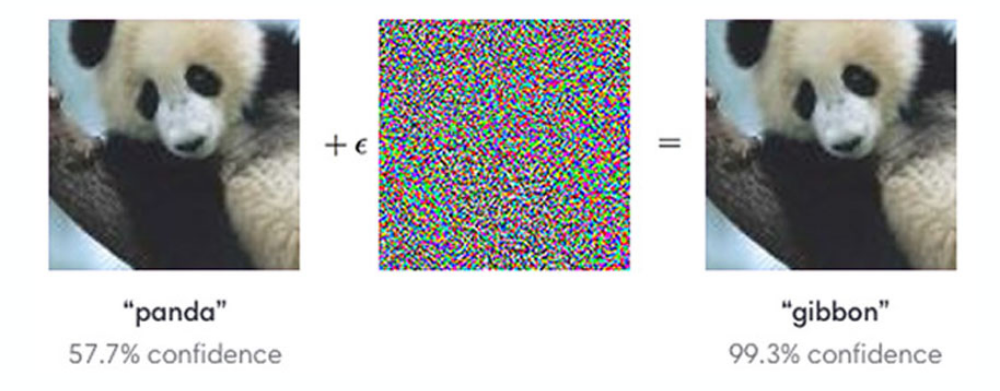

 
Goodfellow, Ian J., Jonathon Shlens, and Christian Szegedy. "Explaining and harnessing adversarial examples." (2014).

---
### Highlighting Important Words
- One common interpretation technique is to highlight **important words.**
- Remove each word, one at a time, and observe the change in confidence.
    - Slow
   - We can approximate with input gradient (Simonyan et al., 2014)

Shi Feng, Eric Wallace, Alvin Grissom II, Mohit Iyyer, Pedro Rodriguez, Jordan Boyd-Graber "Pathologies of neural models make interpretations difficult." EMNLP (2018).

---
- One common interpretation technique is to highlight **important words.**
- Remove each word, one at a time, and observe the chane in confidence.
    - Slow
   - We can approximate with input gradient (Simonyan et al., 2014)

Shi Feng, Eric Wallace, Alvin Grissom II, Mohit Iyyer, Pedro Rodriguez, Jordan Boyd-Graber "Pathologies of neural models make interpretations difficult." EMNLP (2018).

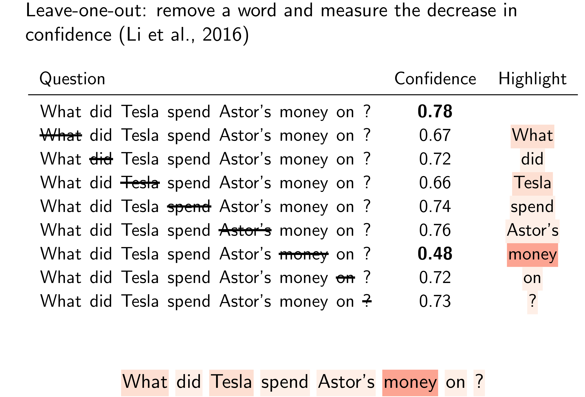  

---

# Input Reduction

What if we removed **unimportant words** without changing predictions?

---

# Model Overconfidence

__
  
---

---
# All Examples Drastically Reduced

- We can consistently reduce examples to very short lengths without changing the prediction.

---

 Confidence remains high on reduced examples.

 
 
---

# Humans Confused by Reduced Inputs
- Reduced inputs appear random to humans.

---

 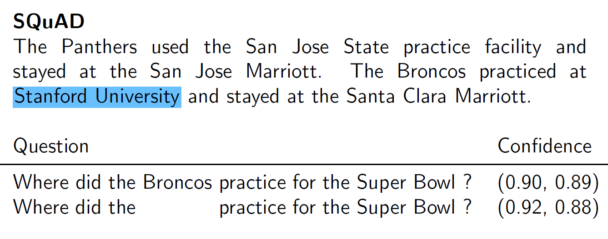

- After first reduction step, already rubbish, but confidence remains high.

---
# How did this happen?

Impliict bag-of-words assumption.

---

# Mitigation
- Can this be mitigated?
   * Yes! Modify objective function to co-optimize for high entropy on reduced examples.
   * Ideally, we want a model to say "I don't know" when it doesn't know (uniform distribution of confidences)

   $$
    \sum_{(\mathbf{x},y)}\log f(y|\mathbf{x}) + \lambda\sum_{\tilde{x}\in \tilde{\mathcal{X}}}\mathbb{H}(f(y|\tilde{\mathbf{x}})),
   $$
   where $\tilde{\mathcal{X}}$ is the set of reduced training examples.

---
   

---
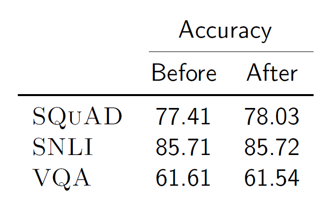

- Accuracy maintained with new model.

---

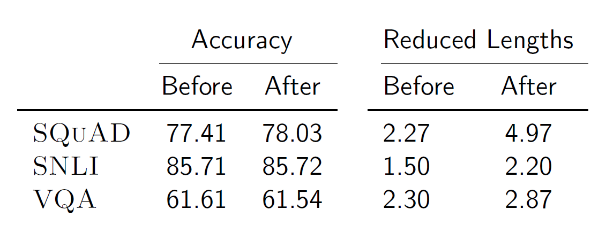
- Length of reduced examples increases, making them less likely to confuse humans.
---

- Input reduction leads to more meaningful examples after regularization.
---

# Summary
- Neural models are overconfident, making interpretations difficult.
    * Poor uncertainty estimates from training.
    * Entropy regularization helps to mitigate.
    
---

# Other Examples of Pathological Behaviors

- Machine Translation
    - "hallucinations" (Lee at al., 2018)

From The Guardian (2017).

---

# Other Examples of Pathological Behaviors

- Machine Translation
    - "hallucinations" (Lee at al., 2018)

From The Guardian (2017).

---

# Other Examples of Pathological Behaviors

- Machine Translation
    - "hallucinations" (Lee at al., 2018)
- Question Answering (Feng et al. 2018)
- Vision (Goodfellow et al., 2017)

---

# Other Examples of Pathological Behaviors

- Machine Translation
    - "hallucinations" (Lee at al., 2018)
- Question Answering
- Vision (Goodfellow et al., 2017)
- These errors are distinct from most forms of "bias," which describe general tendencies.
From The Intercept (2016).

---

# Examining Errors

- We can learn a lot by examining the errors that systems make, just as in humans.
- We know that neural network-based classifiers perform well on some tasks.
    - But we also know that they can sometimes make counterintuivie and unpredictable mistakes.
- How do systems cope with unexpected changes in input?

---
# Neural Network Brittleness
- Neural networks are impressive but brittle and their decision functions are difficult to understand.
- We can design experiments to determine what the networks do or do not learn.

---
# Examining Errors

- Most NLP work is currently focused on increasing accuracy.

- I'm more interested in the mistakes.

---
# Machine Translation
- Originally rule-based.
- Then statistics-based (IBM Models, noisy channel model)
- Now mostly use deep neural networks with attention mechanism (Transformers)

---
# Machine Translation Pathologies

- MT quality is better than ever due to more data and Transformers.
    - But the errors are sometimes bizarre.
    - The worst often called "hallucinations" (Lee et al., 2018)
- On right: examples from Lee et al. (2018) where they add tokens to induce hallucinations.
    
---
Mathing Translation Pathologies

- Lee et al. (2018) 
- Use traning data augmentation (adding random tokens) with perturbed source inputs to increase robustnes, but they still appear

---
# Machine Translaton Pathologies
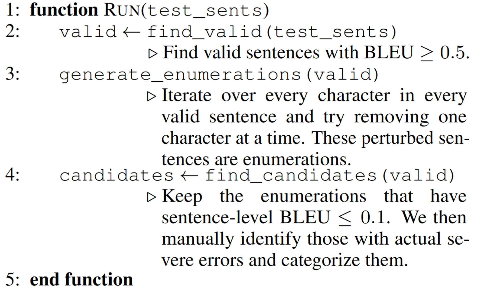
- Our work (Shi et al., 2022) uses **minimal deletion** to induce hallucinations and other severe errors.
- A minimal deletion is a single character or word.
- Detection method similar to Lee et al. (2018)

---
# Machine Translaton Pathologies
 
- We find severe errors by examining sharp deecline in score (drop from greater than 0.5 to less than .1)
- Severe errors are outliers in the overall linear decline in BLEU as more characters are removed.
- Note: I dislike confidence intervals, but they were easy to include.
---

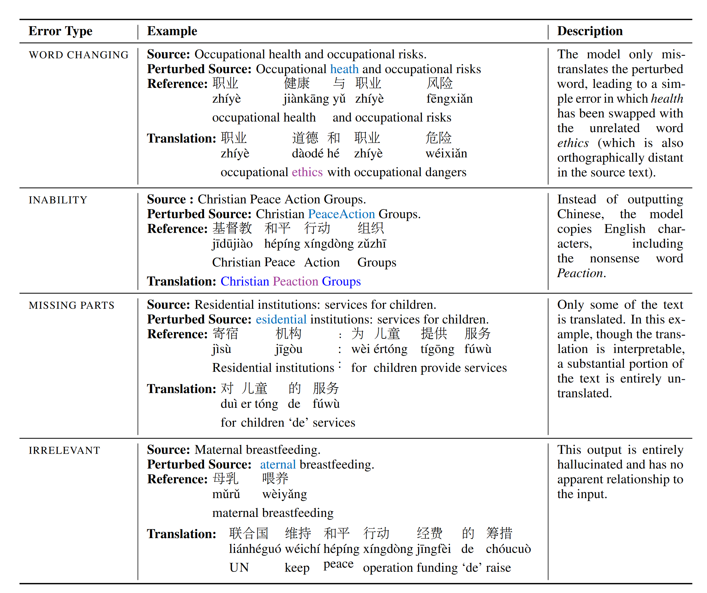 

---
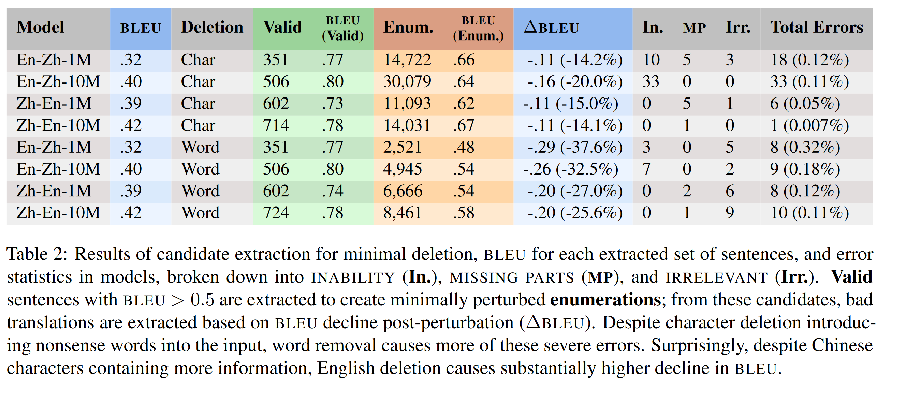
(Shi et al., 2022)

---
### Computing: Dissecting a Face-generating Generative Adversarial Network

---
# Generative Adversarial Networks

- GANs are used to generate deep fakes.
- Potential applications in psychology research.

---
# Generative Adversarial Networks

- GANs (Goodfellow et al., 2014) work in game theoretic scenario.
- **Generator** competes with adversary, **discriminator**.
- Geneator produces $\mathbf{x}\sim g(\mathbf{z};\boldsymbol{\theta}^{(g)})$.
- Discriminator tries to distinguish real from fake exampls.
    - Produces probability $d(\mathbf{x};\boldsymbol{\theta}^{(d)})$ that $x$ is real.
- Game theoretic view: zero-sum game: for you to win, someone else must lose.
- Function $v(\boldsymbol{\theta}^{(d)},\boldsymbol{\theta}^{(d)})$ determines payoff for generator and $-v(\boldsymbol{\theta}^{(d)},\boldsymbol{\theta}^{(d)})$ for discriminator.
- Each learner tries to maximize its own payoff. At convergence:
$$
g* = \underset{g}{\text{argmin}} \underset{d}{\text{ max }} v(g, d)
$$

---
# Dissecting StyleGAN3
- NVIDIA provides several pre-trained models.
- We look at StyleGAN3-r trained on Flikr (FFHQ) data of 60,000 faces.
    - The "average face" is a white female in this dataset.
- To examine what's learned, we look at the **discriminator**
    - Discriminator is a standard convolutional neural network.
    - Look for correlations between abstract image properties and **discriminator score**.
    - Discriminator scores measure confidence that a model is a face.

---
# Dissecting StyleGAN3
- We had hypothesis that brighter images would be favored.
- Calculate normalized **luminance**.
$$
Y = (0.2126)R + (0.7152)G + (0.0722)B
$$
- Is there a correlation between **discriminator score** and **luminance** in the training data?

---
# Dissecting StyleGAN3

- We had hypothesis that brighter images would be favored.
- Calculate normalized **luminance**.
$$
Y = (0.2126)R + (0.7152)G + (0.0722)B
$$
- Is there a correlation between **discriminator score** and **luminance** in the training data?
    - Yeah.
    - But it's not learned from the training data!
---
# Dissecting StyleGAN3
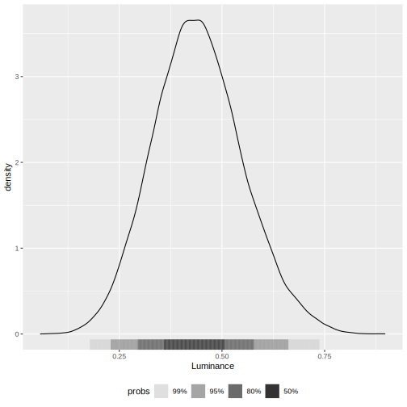
- We had hypothesis that brighter images would be favored.
- Calculate normalized **luminance**.
$$
Y = (0.2126)R + (0.7152)G + (0.0722)B
$$
- Is there a correlation between **discriminator score** and **luminance**?
    - But it's not learned from the data!

---
# Dissecting StyleGAN3

- Clear correlation not explicable by training data.
- What if we look at color?

---
# Dissecting StyleGAN3
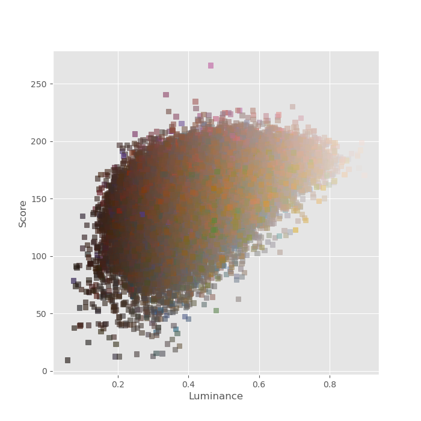
- Clear correlation not explicable by training data.
- What if we look add color?
    - Right: each square is the **mean color** (RGB) of the image at a given point.
    - Note the red/pink outliers.

---
# Dissecting StyleGAN3
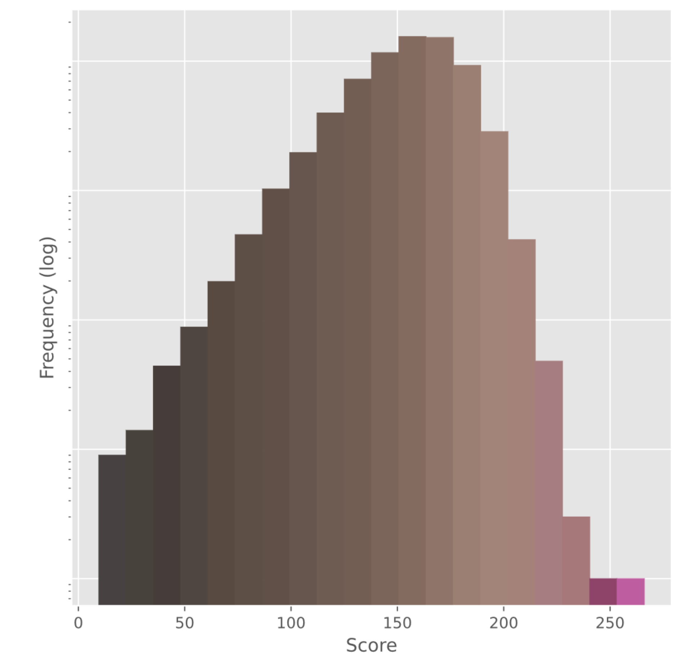
- Each bar color in histogram is the average image color within the binned range.
- Again, not explicable by training data color distribution.
- Pathological preference for red/pink is clear.

---
# Dissecting StyleGAN3
- How might the top 100 and bottom 100 faces look?

---
# Dissecting StyleGAN3
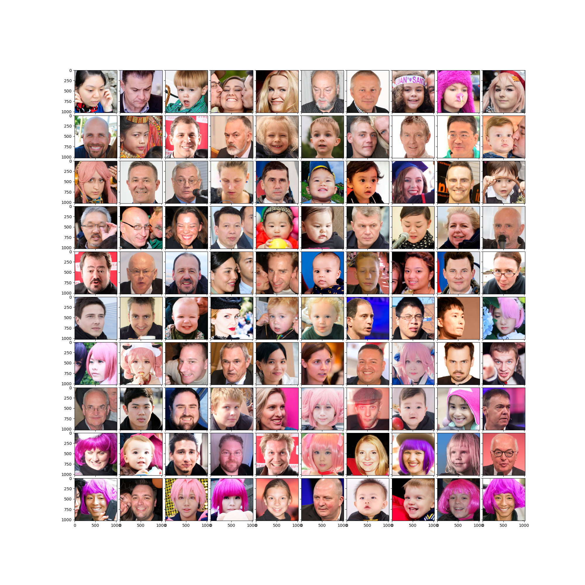
- How might the top 100 and bottom 100 faces look?
    - Top 100

---
# Dissecting StyleGAN3
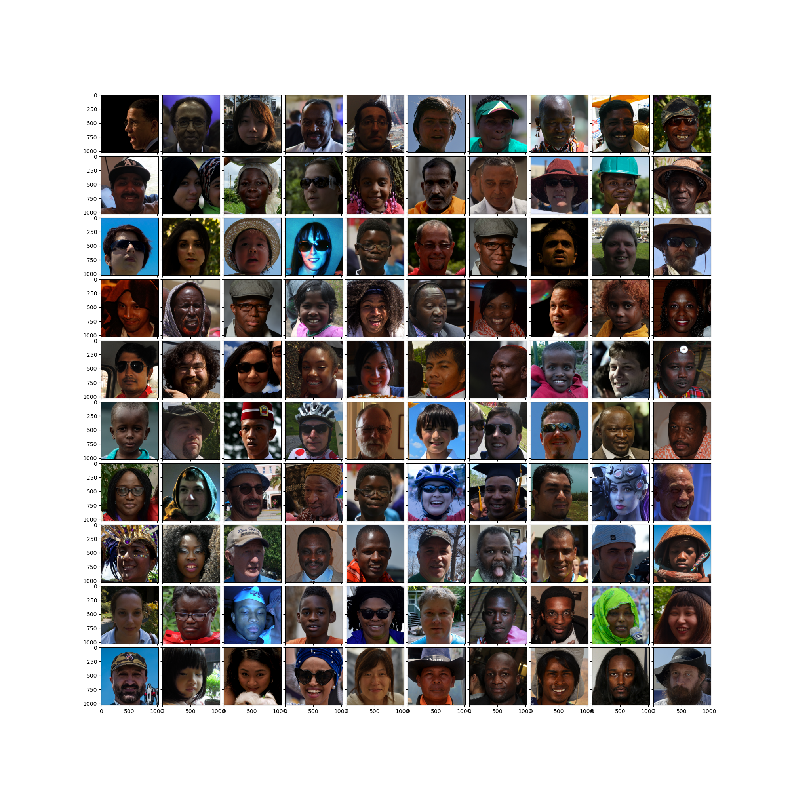
- How might the top 100 and bottom 100 faces look?
    - Bottom 100

---
# Dissecting StyleGAN3

- How might the top 100 and bottom 100 faces look?
    - Crowdsourced perceived race (US census racial categories).

---
# Dissecting StyleGAN3
- So far, we've looked at training data scores.
- For novel faces, scrape from Google Image Search
    - have crowd workers annotate for perceived race.
- Hypothesis: 
    - "gender atypical" faces dispreferred
        - women with short hair, men with long hair

---
# Dissecting StyleGAN3
- 
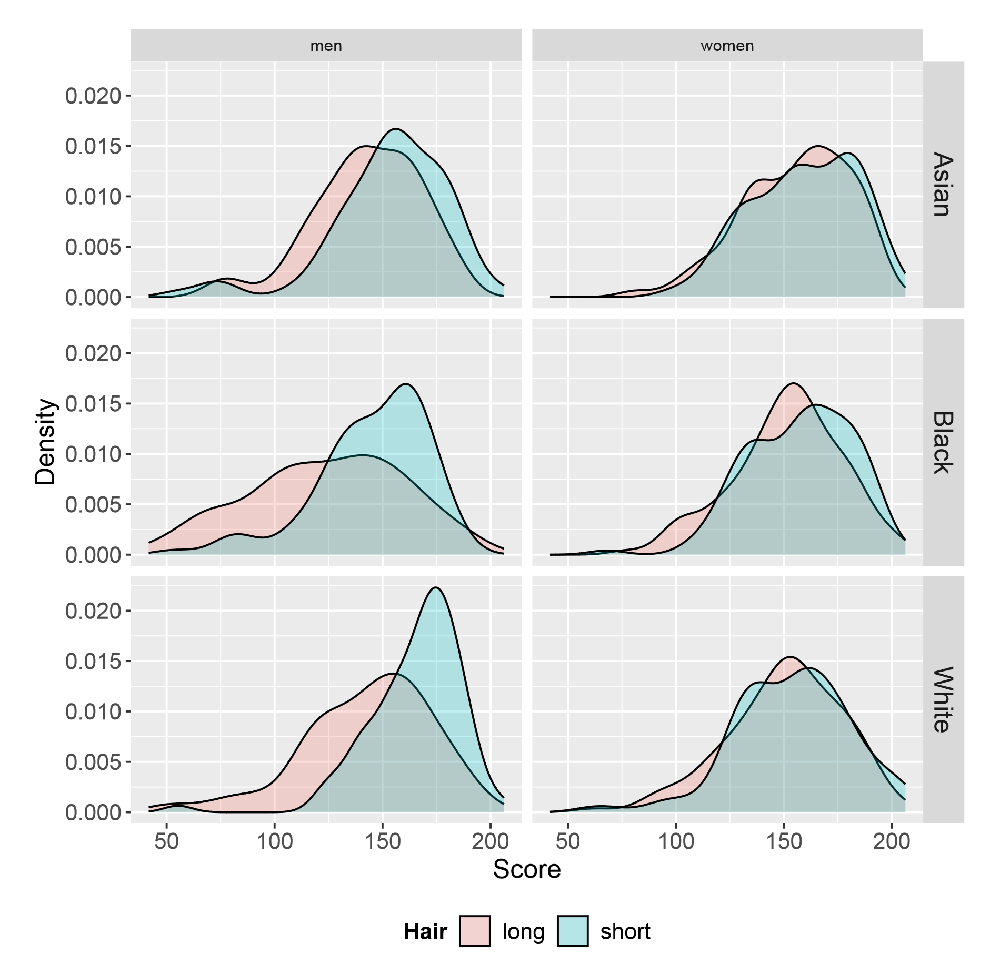

---
#### References 1
Feng, Shi, Eric Wallace, Alvin Grissom II, Mohit Iyyer, Pedro Rodriguez, and Jordan Boyd-Graber. "Pathologies of Neural Models Make Interpretations Difficult." In Proceedings of the 2018 Conference on Empirical Methods in Natural Language Processing, pp. 3719-3728. 2018.

Shi, Ruikang, Alvin Grissom II, and Duc Minh Trinh. "Rare but Severe Neural Machine Translation Errors Induced by Minimal Deletion: An Empirical Study on Chinese and English." In Proceedings of the 29th International Conference on Computational Linguistics, pp. 5175-5180. 2022.

Grissom II, Alvin, Ryan F. Lei, Jeova Farias Sales Rocha Neto, Matt Gusdorff, Bailey Lin, and Ryan Trotter. "Examining Pathological Bias in a Generative Adversarial Network Discriminator: A Case Study on a StyleGAN3 Model." arXiv preprint arXiv:2402.09786 (2024).

---
### References 2

Lee, Katherine, Orhan Firat, Ashish Agarwal, Clara Fannjiang, and David Sussillo. "Hallucinations in neural machine translation." (2018)
