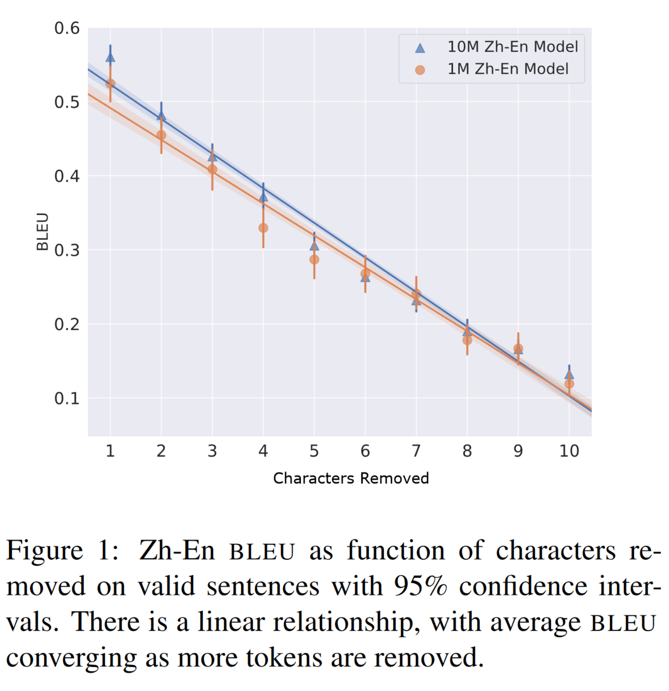

# Pathological Properties of Deep Learning Models: Some Cases in Language and Vision 

---
# Outline
- Self-introduction
- Pathological errors in NLP systems
-  Stress testing MT models with perturbations
- (If there's time) Analogues in computer vision.
---

---
# Self-Introduction
- Associate Professor of Computer Science at Haverford College (near Philadelphia, Pennslvania, USA) 
    - Undergraduate liberal arts college
    - Visiting Scholar, University of Tokyo
- Computational linguist
- Ph.D. (2017) in Computer Science from University of Colroado Boulder with Jordan Boyd-Graber

---
# Self-Introduction

- Currently interested in:
    - statistical/computational epistemology
        - What (if anything) do models tell us about what they're (supposedly) modeling?
    - evaluation
        - Related: How can we better evaluate (without importing broken paradigms from other fields)
     - generalization
        - Do these models generalize or just seem appear to?
    - pathologies in models (today's talk)
        - Unexpected behaviors of learned models.

---
# Pathologies in Natural Language Processing
 - Question answering
 - Machine translation

---
# Pathologies in Natural Language Processing
 - **Question answering**
 - Machine translation

---
# Model Overconfidence
- Well-documented adversarial attacks in computer vision (Goodfellow et al., 2014)

 
Goodfellow, Ian J., Jonathon Shlens, and Christian Szegedy. "Explaining and harnessing adversarial examples." (2014).

---
### Highlighting Important Words
- One common interpretation technique is to highlight **important words.**
- Remove each word, one at a time, and observe the change in confidence.
   - We can approximate this (Simonyan et al., 2014)

Shi Feng, Eric Wallace, Alvin Grissom II, Mohit Iyyer, Pedro Rodriguez, Jordan Boyd-Graber "Pathologies of neural models make interpretations difficult." EMNLP (2018).

---
- One common interpretation technique is to highlight **important words.**

Shi Feng, Eric Wallace, Alvin Grissom II, Mohit Iyyer, Pedro Rodriguez, Jordan Boyd-Graber "Pathologies of neural models make interpretations difficult." EMNLP (2018).

  

---

# Input Reduction

What if we removed **unimportant words** without changing predictions?

---

# Model Overconfidence

__
  
---

---
# All Examples Drastically Reduced

- We can consistently reduce examples to very short lengths without changing the prediction.

---

 Confidence remains high on reduced examples.

 
 
---

# Humans Confused by Reduced Inputs
- Reduced inputs appear random to humans.
- On right: accuracy of humans vs. random inputs
    - humans don't prefer reduced inputs over random inputs
- Thus, models are miscallibrated.

---

 

- After first reduction step, already rubbish, but confidence remains high.

---
# How did this happen?

Impliict bag-of-words assumption.

---

# Mitigation
- Can this be mitigated?
   * Yes! Modify objective function to co-optimize for high entropy on reduced examples.
   * Ideally, we want a model to say "I don't know" when it doesn't know (uniform distribution of confidences)

   $$
    \sum_{(\mathbf{x},y)}\log f(y|\mathbf{x}) + \lambda\sum_{\tilde{x}\in \tilde{\mathcal{X}}}\mathbb{H}(f(y|\tilde{\mathbf{x}})),
   $$
   where $\tilde{\mathcal{X}}$ is the set of reduced training examples.

---

 ---
 <!---  --->
<!--- - Model accuracy maintained with new model. --->
<!--- --->

<!-- 
- Length of reduced examples increases, making them less likely to confuse humans.
---

- Input reduction leads to more meaningful examples after regularization.
--- -->

# Summary
- Neural models are overconfident, making interpretations difficult.
    * Poor uncertainty estimates from training.
    * Entropy regularization helps to mitigate.
         - a bit of a hack
    
---

# Other Examples of Pathological Behaviors

- Machine Translation
    - "hallucinations" (Lee at al., 2018)

From The Guardian (2017).

---

# Other Examples of Pathological Behaviors

- Machine Translation
    - "hallucinations" (Lee at al., 2018)
- Question Answering
- Vision (Goodfellow et al., 2017)
- These errors are distinct from most forms of "bias," which describe general tendencies.
From The Intercept (2016).

---

# Examining Errors

- We can learn a lot by examining the errors that systems make, just as in humans.
- We know that neural network-based classifiers perform well on some tasks.
    - But we also know that they can sometimes make counterintuivie and unpredictable mistakes.
- How do systems cope with unexpected changes in input?

---
# Neural Network Brittleness
- Neural networks are impressive but brittle and their decision functions are difficult to understand.
- We can design experiments to determine what the networks do or do not learn.

---
# Examining Errors
- Work with my student Ruikang Shi (now at Google)

- Most NLP work is currently focused on increasing accuracy.

- I'm more interested in the mistakes.

---
# Machine Translation
- Originally rule-based.
- Then statistics-based (IBM Models, noisy channel model)
- Now mostly use deep neural networks with attention mechanism (Transformers)

---
# Machine Translation Pathologies

- MT quality is better than ever due to more data and Transformers.
    - But the errors are sometimes bizarre.
    - The worst often called "hallucinations" (Lee et al., 2018)
- On right: examples from Lee et al. (2018) where they add tokens to induce hallucinations.
    
---
Mathing Translation Pathologies

- Lee et al. (2018) 
- Use traning data augmentation (adding random tokens) with perturbed source inputs to increase robustnes, but they still appear

---
# Machine Translaton Pathologies

- Our work (Shi et al., 2022) uses **minimal deletion** to induce hallucinations and other severe errors.
- A minimal deletion is a single character or word.
- Detection method similar to Lee et al. (2018)

---
# Machine Translaton Pathologies
 
- We find severe errors by examining sharp deecline in score (drop from greater than 0.5 to less than .1)
- Severe errors are outliers in the overall linear decline in BLEU as more characters are removed.
- Note: I dislike confidence intervals, but they were easy to include.
---

 

---

Shi, Ruikang, Alvin Grissom II, and Duc Minh Trinh. "Rare but Severe Neural Machine Translation Errors Induced by Minimal Deletion: An Empirical Study on Chinese and English." Proceedings of the 29th International Conference on Computational Linguistics. 2022.

---
# Work in progress: Perturbation Experiments
- Work with my student Simon Babb (now at Amazon)
- Word Order
- Linguistically-motivated tokens

---
# Word Order
## Stress Testing NMT on Word Order

- Question: How much does correct word order matter for NMT?
    - Hypothesis: Not as much as we may think.
- Experiment: Train two models
    - one on shuffled source sentences
    - one on normal source sentences

---
# Stress Testing on Word Order
$$
\tilde{e} = \underset{e}{\text{argmax }} p(f|e) p(e)
$$
- If model is very good at modeling $p(e)$, it could still work.
---
# Results

---
# Results
- En-Zh is more sensitive
- En-Es is extremely robust
    - Shuffled English-Spanish higher than some normal models!

---
# Results
- What if we incrementally shuffle at test time?

---

(Babb and Grissom, 2024, in revision)

---
# Experiment 2: Mononlingual Reconstruction
- What if we do monolingual "translation"
- E.g., shuffling English source and train model to reorder.
- Removes word order information
- Isolates difficulty of word order from difficulty of translation.

---
# Experiment 2 Results

(Babb and Grissom, 2024, in revision)

---

(Babb and Grissom, 2024, in revision)

---
# Another Example: Case Markers in Japanese
- Work with my student Bailey (Machiko) Hitora

---
# Case Marker Robustness
- Case markers are instrumental in Japanese sentence processing for humans (Yamashita, 1997; Grissom II et al. 2016) and machines (Li et al. 2020).
- On right: Li et al. 2020 examine case markers' role in incremental verb prediction.

---
# Case Marker Experiment:
- Train two models:
     - one with source case markers
     - one without case markers
     は　で　に　が　を　と
- Test on sentences with and without case markers.

---
# Case Marker Experiment Results:

---
# Case Marker Experiment Results:

- No much of a difference.
    - Weird.
- Model trained without them is more robust.
    - Intuitive.

---

# Linguistically-motivated Perturbations:
- Work-in-progress with with Seun Eisape (soon PhD student at UC Berkeley)

---
# Linguistically-motivated Perturbations
- Instead of deleting random characters, delete categories.
- Hypothesis: Chinese (for example) will not be sensitive to tense.

---

(Eisape and Grissom II, 2024, in prep)

---
# Preliminary Conclusions
- Models may rely on linguistic information if it's available
    - But they don't seem to be in any meaningful way.
- Transformers (as we know) are extremely powerful language modelers.
    - Fluent output can appear correct and still be wrong.
- Be careful about assigning linguistic meaning to fluent output in transformers.

---

### Computer Vision: Dissecting a Face-generating Generative Adversarial Network

---
# Generative Adversarial Networks

- GANs are used to generate deep fakes.
- Potential applications in psychology research.

---
# Generative Adversarial Networks

- GANs (Goodfellow et al., 2014) work in game theoretic scenario.
- **Generator** competes with adversary, **discriminator**.
- Geneator produces $\mathbf{x}\sim g(\mathbf{z};\boldsymbol{\theta}^{(g)})$.
- Discriminator tries to distinguish real from fake exampls.
    - Produces probability $d(\mathbf{x};\boldsymbol{\theta}^{(d)})$ that $x$ is real.
- Game theoretic view: zero-sum game: for you to win, someone else must lose.
- Function $v(\boldsymbol{\theta}^{(d)},\boldsymbol{\theta}^{(d)})$ determines payoff for generator and $-v(\boldsymbol{\theta}^{(d)},\boldsymbol{\theta}^{(d)})$ for discriminator.
- Each learner tries to maximize its own payoff. At convergence:
$$
g* = \underset{g}{\text{argmin}} \underset{d}{\text{ max }} v(g, d)
$$

---
# Dissecting StyleGAN3
- NVIDIA provides several pre-trained models.
- We look at StyleGAN3-r trained on Flikr (FFHQ) data of 60,000 faces.
    - The "average face" is a white female in this dataset.
- To examine what's learned, we look at the **discriminator**
    - Discriminator is a standard convolutional neural network.
    - Look for correlations between abstract image properties and **discriminator score**.
    - Discriminator scores measure confidence that a model is a face.

---
# Dissecting StyleGAN3
- We had hypothesis that brighter images would be favored.
- Calculate normalized **luminance**.
$$
Y = (0.2126)R + (0.7152)G + (0.0722)B
$$
- Is there a correlation between **discriminator score** and **luminance** in the training data?

---
# Dissecting StyleGAN3

- We had hypothesis that brighter images would be favored.
- Calculate normalized **luminance**.
$$
Y = (0.2126)R + (0.7152)G + (0.0722)B
$$
- Is there a correlation between **discriminator score** and **luminance** in the training data?
    - Yeah.
    - But it's not learned from the training data!
---
# Dissecting StyleGAN3

- We had hypothesis that brighter images would be favored.
- Calculate normalized **luminance**.
$$
Y = (0.2126)R + (0.7152)G + (0.0722)B
$$
- Is there a correlation between **discriminator score** and **luminance**?
    - But it's not learned from the data!

---
# Dissecting StyleGAN3

- Clear correlation not explicable by training data.
- What if we look at color?

---
# Dissecting StyleGAN3

- Clear correlation not explicable by training data.
- What if we look add color?
    - Right: each square is the **mean color** (RGB) of the image at a given point.
    - Note the red/pink outliers.

---
# Dissecting StyleGAN3

- Each bar color in histogram is the average image color within the binned range.
- Again, not explicable by training data color distribution.
- Pathological preference for red/pink is clear.

---
# Dissecting StyleGAN3
- How might the top 100 and bottom 100 faces look?

---
# Dissecting StyleGAN3

- How might the top 100 and bottom 100 faces look?
    - Top 100

---
# Dissecting StyleGAN3

- How might the top 100 and bottom 100 faces look?
    - Bottom 100

---
# Dissecting StyleGAN3

- How might the top 100 and bottom 100 faces look?
    - Crowdsourced perceived race (US census racial categories).

---
# Dissecting StyleGAN3
- So far, we've looked at training data scores.
- For novel faces, scrape from Google Image Search
    - have crowd workers annotate for perceived race.
- Hypothesis: 
    - "gender atypical" faces dispreferred
        - women with short hair, men with long hair

---
# Dissecting StyleGAN3
- Distinct patterns distributions perceived race and hair length.

---
#### Dissecting StyleGAN3
Bayesian linear regression on red, green, and blue's contribution
###### Priors:
Let $C=\{r,g,b\}$.

$$
\begin{aligned}
    y &\sim \mathcal{N}(\mu_{\text{score}}, \sigma_{\text{score}}), \text{ where } \\
    \mu_{\text{score}} &= \beta_0 + \beta_r x_r + \beta_g x_g + \beta_b x_b,  \\
    \sigma_{\text{score}} &\sim \text{Half-}t(\sigma=1, \nu=10), \\
    \sigma_{c} &\sim \text{Half-}t(\sigma=1, \nu=10), \forall c\in C,\\
    \beta_0 &\sim \mathcal{N}(\mu=\bar{x}_{\text{score}},\sigma=\sigma_0), \\
    \beta_r &\sim \mathcal{N}(\mu=0, \sigma=\sigma_r), \\
    \beta_g &\sim \mathcal{N}(\mu=0, \sigma=\sigma_g), \\
    \beta_b &\sim \mathcal{N}(\mu=0, \sigma=\sigma_b). 
\end{aligned}
$$

---
# Dissecting StyleGAN3
- Is it just color?

- Crowdsource labels based on perceived features of scraped faces.
    * $C$ = {Afrocentricity, Asiocentricity, Eurocentricity, hair length, masculinity, femininity}.
    * 1-7 scale
    * Examine how much each contribute to distriminator score in a (Bayesian) linear regressiob.
---
# Dissecting StyleGAN3

Priors:
$$
\begin{equation}
    \begin{aligned}
    y &\sim \mathcal{N}(\mu_{\text{score}}, \sigma_{\text{score}}), \text{ where } \\
    \mu_{\text{score}} &= \beta_0 + \boldsymbol\beta^\top \mathbf{x},  \\
      \sigma_{\text{score}} &\sim \text{Half-Cauchy}(\gamma=10), \\  
     \sigma_{c} &\sim \text{Half-}t(\sigma=1, \nu=10),  \forall c\in C, \\
     \mu_c &\sim \mathcal{N}(\mu=0, \sigma=\sigma_c), \forall c\in C \\
    %\sigma_{\text{score}} &\sim \text{Half-Normal}(s_{\text{score}}), \\
    \nu_\beta &\sim \text{Half-Cauchy}(\gamma=2), \\
     \beta_{c} &\sim t(\nu=\nu_\beta, \mu=\mu_c, \sigma=\sigma_c), \forall c\in C.
\end{aligned}
\end{equation}
$$

---
# Dissecting StyleGAN3

- Is it just color?
    - Maybe not.
    - Certain perceived races seem to be penalized more.
        - Inconclusive.

---

# Dissecting StyleGAN3
Is it just color? One more experiment.
- Train two depth-limited decision trees (depth 5).
    - Look at the splitting nodes.
    - Reduces Gini impurity (related to entropy/information gain)
        - how often would $x$ be misclassified if randomly labeled?
- Only a few categories end up in the tree
    - **root, depth 1:** red
    - **depth 2:** red, blue, masculinity
    - **depth 3:** red, blue, masculinity, Eurocentricity
    - **depth 4:** red, blue, green, masculinity, Afrocentricity, skintone
   
---
# StyleGAN3 Conclusions

- Clearly a severe color bias 
    - Sometimes highly pathological (e.g., red/pink preference)
- But some evidence that other face/picture qualities are also penalized.
- **Not** explainable from training data alone.
- Future work: how well does this generalize between training runs and architectures?

---
# Overall Conclusions

- Neural network complexity lends them to highly pathological behaviors.
- Inscrutable, but we can at least characterize the problems.

---
#### References 1
Feng, Shi, Eric Wallace, Alvin Grissom II, Mohit Iyyer, Pedro Rodriguez, and Jordan Boyd-Graber. "Pathologies of Neural Models Make Interpretations Difficult." In Proceedings of the 2018 Conference on Empirical Methods in Natural Language Processing, pp. 3719-3728. 2018.

Shi, Ruikang, Alvin Grissom II, and Duc Minh Trinh. "Rare but Severe Neural Machine Translation Errors Induced by Minimal Deletion: An Empirical Study on Chinese and English." In Proceedings of the 29th International Conference on Computational Linguistics, pp. 5175-5180. 2022.

Grissom II, Alvin, Ryan F. Lei, Jeova Farias Sales Rocha Neto, Matt Gusdorff, Bailey Lin, and Ryan Trotter. "Examining Pathological Bias in a Generative Adversarial Network Discriminator: A Case Study on a StyleGAN3 Model." arXiv preprint arXiv:2402.09786 (2024).

---
### References 2

Lee, Katherine, Orhan Firat, Ashish Agarwal, Clara Fannjiang, and David Sussillo. "Hallucinations in neural machine translation." (2018)
