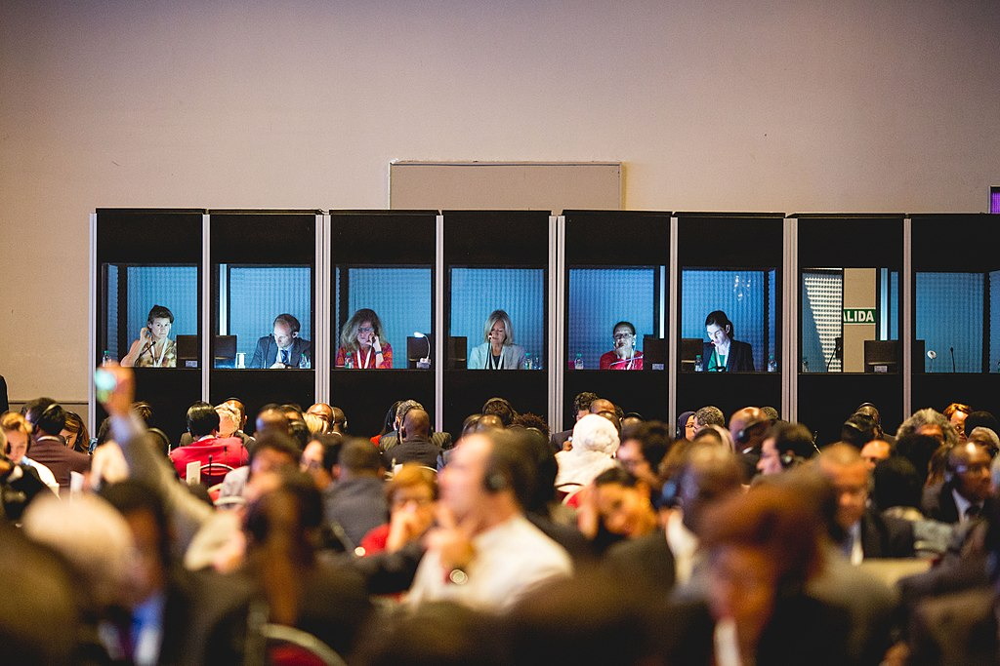

# Rapidly Piloting Real-time Linguistic Assistance for Simultaneous Interpreters with Untrained Bilingual Surrogates

Alvin Grissom II1, Jo Shoemaker2, Ben Goldman1, Ruikang Shi1,
Craig Stewart3, C. Anton Rytting3, Leah Findlater4, and Jordan Boyd-Graber2

1Haverford College 
2University of Maryland
3Carnegie Mellon University
4University of Washington

---
# Outline

- Introduction and Background
    - Primary contributions
    - Simultaneous Interpretation
    - Real-time Assistance
    - Proxies
- Contributions
    - Survey Interpreters' Needs
    - Proxies as Surrogated for Professionals
    - Real-time Assistance UI
    - Word Difficulty Metric
    - Evaluation
- Conclusions

---
# Primary Contributions
 - Survey professional interpreters to gauge preferred kinds of assistance
 - Evaluate assistance methods with expert translat
 - Fast evaluation scheme for SI that only requires bilingual (non-professional) participants

---
# Simultaneous Interpreation

- *Real-time* interpretation of utterances from one language to another
- Immense cognitive load
- Professionals struggle with technical ters, proper nouns, colloquialisms
- Professionals often work in pairs, where one person takes notes, looks up references, etc.

---
# Simultaneous Interpreation
- Computerized assistance has long been used by professional translators
    - Technology can also help interpreters
- Often systems rely on predictions of future tokens
    - Real-time assistance displays translations *after* utterance

---
# Limits of Evaluation
- Vetting assistance hampered by logistical and financial difficulties of hiring professionals
- Crowdsourcing platforms provide access to bilingual individuals but lack SI training
- We investigate the suitability of non-professional bilingual people (**proxies**) as temporary surrogates in early design phases of SI assistance

---
# What do interpreters want?
- We surveyed $N=20$ SI professionals and students.
    - Most interested in receiving help with items hard to retrieve from memory
        - High information, low frequency items
        - Top three items: 
            - **dates and numbers**
            - **names of people and places**
            - **translations of individual key terms**
        - Too much information is distracting
- System should focus on high-priority items: numerals and dates, named entities, key terms

---
# Experimental SI Task

- Interpreters are in-demand, rare professionals
- Automated metrics (e.g., BLEU) enabled rapid progress in machine translation
- Untrained bilingual people are not perfect substitute for professionals
    - But might suffice as **proxies** for guiding design

---
# Experimental SI Task
- Interpreters are trained to cope with cognitive load and multitasking compared to translators
- Hypothesis: Bilingual **proxies** respond similarly to interpreters when working in conditions that address their comparable shortcomings
- We present proxies with same challenges faced by professionals while preventing them from becoming overhwlemed.

---
# Experimental SI Task
## Four Major SI Challenges (Giles, 2009)
- listening while speaking (multitasking)
- rapid translation (timing)
- understanding the topic area of speech (content)
- mantaining stamina (stamina)

---
# Experimental SI Task
## Four Major SI Challenges (Giles, 2009)
- Multitasking and timing are key for SI
    - Eliminating completely would invalidate our experiments
- Concessions for multitasking:
    - progress bars
    - three-second delay
- We focus on content
    - conditions manipulate whether translations appear aove the sentence progress bar (immediately)

---
# Proxy SI Task

- Our UI alleviates some cognitive control issues
- As audio plays, progress bars fill from top to bottom
    - Blue: proxies need only listen
    - Orange: proxies should prepare to translate
    - Red: proxies should be translating

---
# Proxy SI Task

- We ameliorate stamina requirements
    - Proxies only directed to interpret intermittent, nonconsecutive sentences (used in  Lasecki et al. 2012)
    - Focus on content

---
# Evaluating Assistance
- We compare quality across four assistance conditions
    - **NO HELP**: baseline with no assistance
    - **EXPERT HELP**: baseline where system displays terms a human interpreter deemed difficult
    - **NUMBER HELP**: display translations for names and numbers
    - **TERM HELP**: display most difficult non-stopword tokens according to an entropy-based metric (Schaeffer et al. 2015)
- Each help term displayed for roughly same amount of time

---
# Dataset
- Spanish Speeches: Audio from Creative Commons-license YouTube video from Mayo Clini, CDC, and FDA either recorded or human-captioned in Spanish and English.
- English speeches: four excerpted recordings of quarterly earnings calls from Alphabet, Blizzard, Costco, and United Healthcare
- All speeches  approximately 5 minutes

---
# Participants
- **Proxies** ($N=64$) recruited from Upwordk and Amazon Mechanical Turk for English-Spanish or Spanish-English interpretation
- Paid USD $12 for 45-minute session
- Screened for fluency and shown instructional video
- Try task with 90-second practice video
- Finally, attempt task on three random speeches
    - For Spanish-English: **NO HELP**, **EXPERT HELP**, **TERM HELP**
    - For English-Spanish: **NO HELP**, **TERM HELP**, **NUMBER HELP**

---
# Participants
- **Professionals** ($N=13$) recruited from ProZ.com, a freelancing website for language professionals
- Paid USD $25 for 20-minute session
- Shown tutorial to introduce interace
- Record three conditions, in random order, on three random speeches

---
# Transcription
- Translations transcribed by professional transcription serice
- Transcriptions scored against gold-standard translation with METEOR metric
    - preferred over BLEU for sentence-level quality assessment
    - preferable for interpretation

---
# Results and Analysis
- Poxy METEOR scores (0.035-0.380) vary more than professionals' (0.140-0.227)
- **TERM HELP** and **NUMERIC HELP** have higher scores than other conditions for both proxies and professionals

- Both groups respond similarly, though proxies get more help from **NUMERIC HELP**.

---
# Results and Analysis
## Fixed-effects model

- Linear fixed effects model (linear regression) to examine factors' effects on translation quality

    
---
# Results and Analysis
## Fixed-effects model

- **TERM HELP**, **NUMBER HELP**, and Word Count coefficients associated with higher score
- Difficulty hurts translation quality
    - But interaction between Professional and Difficulty
    - Professionals better at handling difficult terms
- Difficulty metric predicts difficullty for proxies, not pros

---
# Results and Analysis
## Fixed-effects model

- **EXPERT HELP** doesn't help over **NO HELP** baseline
- Odd that interventions help more than **EXPERT HELP**
    - Perhaps signle annotator's judgments don't generalize
    - Higher rate of infrequent cognates in **EXPERT HELP** condition might make it less effective