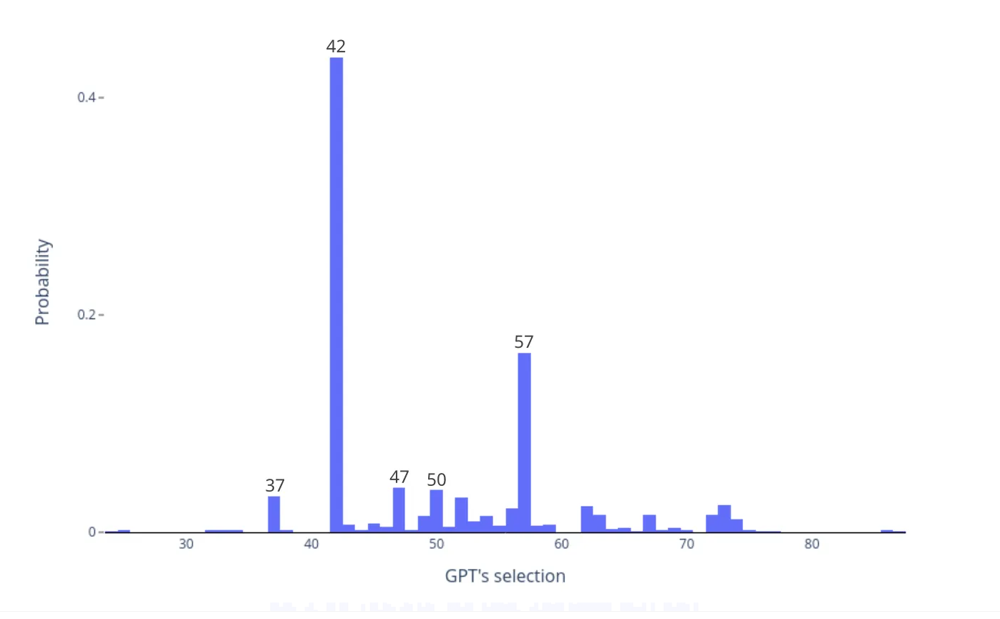

# Demystifying Large Language Models:

---
# Outline
- Overview of computational linguistics and NLP
- Statistical Language Modeling
- Artificial Intelligence
- Word Embeddings
- Large Language Models
- Chatbots
- Ethical issues and risks

---
# What is Computational Linguistics?
- Can divide into overlapping areas
    - Natural Language Processing (NLP) and Human Language Technologies
        - Develop technologies that use or process human language.
        e.g., machine translation, text-to-speech, speech-to-text, web search, virtual assistants, question answering, etc.
    - Computational Study of Language
        - Study language with computational techniques and tools.
        e.g., corpus linguistics, annotation
---
# Examples of NLP/CL

---
# Examples of NLP/CL

---
# Examples of NLP/CL

---
# Examples of NLP/CL

---
# Examples of NLP/CL

---
# Examples of NLP/CL
Automatic Captioning

Image from [Microsoft Teams support site](https://support.microsoft.com/en-us/office/use-live-captions-in-a-teams-meeting-4be2d304-f675-4b57-8347-cbd000a21260)

---
# Problems in Comptuational Linguistics
 ## Syntactic Parsing

---
<!-- footer: "Alvin Grissom II\nHaverford College" -->
# Language Modeling
- Answers question: What is the most probable next word?
    - Equivalently: How probable is a given sentence?
    - Fundamental to most common NLP tasks: translation, speech recognition, etc.

---

# Language Modeling
- Answers question: What is the most probable next word?
    - Equivalently: How probable is a given sentence?
    - Fundamental to most common NLP tasks: translation, speech recognition, etc.
- Thinking question: How many possible sentences are there in English?

---

# Language Modeling
- Answers question: What is the most probable next word?
    - Equivalently: How probable is a given sentence?
    - Fundamental to most common NLP tasks: translation, speech recognition, chatbots, etc.
- Thinking question: How many possible sentences are there in English?
- Another question: What does it mean to say that one sentence is more probable than another?

---
# Language Modeling
- Answers question: What is the most probable next word?
    - Equivalently: How probable is a given sentence?
    - Fundamental to most common NLP tasks: translation, speech recognition, chatbots, etc.
- Thinking question: How many possible sentences are there in English?
- Another question: What does it mean to say that one sentence is more probable than another? 
    - Language modeling attempts to answer this by using a **corpus** (pl. corpora) of text.

---
# Language Modeling
- By using corpora, we can estiamte the probability of the next word in a sentence or phrase.
- Ex: The word "science" is more likely to follow the word "computer" than "kumquat."
- We can use this for autocompletion.
    - In reality, modern autocompletion also uses other information, such as a profile of your recent behavior, location, etc. to inform suggestions.

---
# Language Modeling
- Also works for spelling.

---
# Brief History

- Computational linguistics as a field was born in the 1950's with the Georgetown-IBM experiments in machine translation.
    - Nearly all "AI," including NLP, was rule-based.
- In 1990, a successful approach to machine translation involving Bayesian probability changed the field.

    - Statistical (data-driven) **machine learning** approaches dominated for decades.
- Currently, most NLP research uses machine learning, especially "deep learning."

# What is "Thinking?"
- Turing devised (oft-criticized Turing Test (or "Imitation Game))
- Idea: Can you determine whether your conversational partner is a machine or not?

---
# What is Artificial Intelligence?
- A marketing term for algorithms and statistical models
    - Whatever seems difficult at a given point in time
    - Term seems to originate roughly with Dartmouth Summer Research Project on Artificial Intelligence in 1956 (John McCarthy, Ray Solomonoff, Marvin Minsky, Nathaniel Rochester, Claude Shannon, etc.)
- "AI Effect": Once we sufficiently understand and solve a computational problem, it's no longer considered AI.
    - Tesler's Theorem: "AI is whatever hasn't been done yet."

---
# What is Artificial Intelligence?

---
# ELIZA
- [ELIZA](https://www.masswerk.at/elizabot/), the first chatbot, was created in 1966 by Joseph Weizenbaum.
- Used pattern matching to play the role of a Rogerian therapist.
<iframe width="560" height="315" src="https://www.youtube.com/embed/RMK9AphfLco?si=hNrXI0SjIHWu5PMU" title="YouTube video player" frameborder="0" allow="accelerometer; autoplay; clipboard-write; encrypted-media; gyroscope; picture-in-picture; web-share" referrerpolicy="strict-origin-when-cross-origin" allowfullscreen></iframe>

---
# ELIZA

<iframe width="560" height="315" src="https://www.youtube.com/embed/4sngIh0YJtk?si=SON2WhFB63Ufh7R1" title="YouTube video player" frameborder="0" allow="accelerometer; autoplay; clipboard-write; encrypted-media; gyroscope; picture-in-picture; web-share" referrerpolicy="strict-origin-when-cross-origin" allowfullscreen></iframe>

---
# Machine Learning
- **Machine learning** is an area of computer science concerned with algorithms that allow computers to "learn" from observation.
    

--- 
# Machine Learning 
- **Machine learning** is an area of computer science concerned with algorithms that allow computers to "learn" from observation.
    - For example, learning to **align** words or phrases in two different languages by observing many translated sentences.
    

---

# Machine Learning 
- **Machine learning** is an area of computer science concerned with algorithms that allow computers to "learn" from observation.
    - Another example: SPAM filtering.
    - Show algorithm examples of SPAM and NOT SPAM and it will determine which features are useful for classifying them.
    

---
# Machine Learning

- In one kind of ML, show the algorithm some examples with labels (SPAM, NOT SPAM), and then tries to label new, unseen instances based on what it has learned.

- It's trying to learn "weights" or "parameters" (numbers) of function
    $$
    f(\text{email}) = \text{SPAM}
    $$
    

---
# Machine Learning
- **Neural networks** are popular in machine learning.
    - They're often able to complete more complex tasks than other kinds of models
        i.e., they can "learn" more complex functions.
        

    - The more complex neural networks are called "deep."

---
# Distributional Semantics
- To computers, words are just numbers; we need to give them "meaning."
- **Word embeddings** attempt to calculate similarity between words in a corpus.
    - Based on the **distributional hypothesis**.
        - Similar words tend to occur in similar contexts.
    - Map words to a mathematical vector space with machine learning.
    - Similar words should be near each other in the vector space.
    - Can study correlations with human judgments.
    - See [embedding projector](https://projector.tensorflow.org/).
    
---
# Distributional Semantics
Superlative relations
Image from [GloVe Embeddings](https://nlp.stanford.edu/projects/glove/).

---

# Distributional Semantics
City and zip code
Image from [GloVe Embeddings](https://nlp.stanford.edu/projects/glove/).

---

# Distributional Semantics

Image from [GloVe Embeddings](https://nlp.stanford.edu/projects/glove/).

---
# Distributional Semantics
Diachronic changes in meaning

Image from [Hamilton  et al.](https://nlp.stanford.edu/projects/histwords/)

---
# Distributional Semantics
 Analogical reasoning
 
 Image from [Mikolov et al. (2013)](https://aclanthology.org/N13-1090.pdf).

---

# Distributional Semantics
- Word embeddings are used in almost every modern neural network on text data.
- Question: Whose meaning is being captured?

---

# Distributional Semantics
- Word embeddings are used in almost every modern neural network on text data.
- Question: Whose meaning is being captured?
- Word embeddings are known to encode biases from the data.
    - Embeddings can encode dubious relations.
    The same algorithm that find:
    $$
    \text{man} - \text{woman} \approx \text{king} - \text{queen}
    $$
    also finds
    $$
    \text{man} - \text{woman} \approx \text{computer programmer} - \text{homemaker}
    $$
    [(Bolukbasi et al., 2016)](https://proceedings.neurips.cc/paper/2016/file/a486cd07e4ac3d270571622f4f316ec5-Paper.pdf)

---

# Distributional Semantics
- Word embeddings are used in almost every modern neural network on text data.
- Question: Whose meaning is being captured?
- Word embeddings are known to encode biases from the data.
    - Embeddings can encode dubious relations.
    The same algorithm that find:
    $$
    \text{man} - \text{woman} \approx \text{king} - \text{queen}
    $$
    also finds
    $$
    \text{man} - \text{woman} \approx \text{computer programmer} - \text{homemaker}
    $$
    [(Bolukbasi et al., 2016)](https://proceedings.neurips.cc/paper/2016/file/a486cd07e4ac3d270571622f4f316ec5-Paper.pdf)

---
# Neural Networks
- "Neural networks" are complex functions used to make a prediction.
    - Each "neuron" (circle) is a miniature, simpler machine learning model.
    - Simplest NNs have an input layer $\mathbf{x}$, one or more "hidden layers" $h_i$, and an output layer producing output $\hat{y}$.
$$
\hat{y} = f(g(h(\mathbf{x})))
$$

---
# Neural Networks
$$
\hat{y} = f(g(h(\mathbf{x})))
$$

- They don't really work like the brain. 
    - If it helps, call them "successive multiplications."
- Deep learning started taking off around 2014-2015.

---
# "Generative" Machine Learning
- We can have language models based on neural networks instead of pure statistics.
    - "neural language models" are very good next-word predictors
- Most successful approach is called a "transformer."

---

# Deep Learning for Language Modeling
- As with statistical methods, use prior words to predict next word.
- Word embeddings are used to learn relationships between words.
- The more data, the better the predictions
- The better the model architecture, the better the predictions.

---
# Transformers

- **Transformers** are the state of the art in language modeling.
- Transformers allow for arbitrarily long prior context for predicting the next word.
- Use **attention mechanism** to capture relationships between words.
- Benefit from huge amounts of data.

---
# Transformers
### Attention Mechanism (Vaswani et al., 2017)

---
# Large Language Models 
- Transformers are the basis of **language language models** (LLMs).
    - Started with BERT.
        - Later: RoBERTa, ERNIE, KERMIT, Muppet, ELMo, Rosita, Big BIRD, GPT-2, etc.
        - More recently: GPT Neo, GPT-3, Flan, etc.

---
# BERT

- Transformer-based model
    - Using BERT as a basis for "pre-training" aced a huge number of NLP benchmarks.
    - Basic training procedure:
1. **Pre-train** model on several general tasks using a huge amount of data
2. **Fine-tune** model for specific task, using pre-trained model as a basis.

---
# BERT Pre-training

Train to do the following:

1. Randomly hide words and train model to predict them.
2. Predict the next sentence.
    - Show model true next sentence and random sentence and have it pick one.

---
### BERT

---
### BERT

---
### GPT-3 (Brown et al., 2020)
- 175 billion parameters
    - 10 times as many as previous models
    - Can perform many tasks after seeing a few examples

---
### GPT-3 (Brown et al., 2020)

---
# GPT-3

- Demonstrated **few-shot learning**
    - Pre-trained GPT-3 model can learn to do a task by seeing just a few examples.
        - Doesn't require updating model

---
# GPT-3

- Trained on Common Crawl dataset
    - nearly one trillion words

- Supports 2,048 characters of prior context.

---
# GPT-3

---
# ChatGPT

- Based on GPT-3.5, but adds **reinforcement learning** with human feedback.
    - Reinforcement learning is an area of machine learning that allows the algorithms to learn from experience.
    - Uses a **reward (cost) function** to encourage or discourage certain actions.
    - If the model does something good, reward it; if it does something bad, punish it.
        - Model generalizes what "good" and "bad" responses are like.
    - In ChatGPT, humans rank responses to queries.

---
# ChatGPT
- In reinforcement learning, the **agent** takes an **action** (e.g., outputting a word or words).
- Based on these actions, it receives a **reward** (or incurs a **cost**).

---
# ChatGPT

- GPT 3.5, fine-tuned on instruction-giving datasets.
    - prior version caled InstructGPT.

 Image from Wei et al. (2022)

---
# ChatGPT

- Based on GPT-3.5, but adds **reinforcement learning** with human feedback.
    - Reinforcement learning is an area of machine learning that allows the algorithms to learn from experience.
    - Uses a **reward (cost) function** to encourage or discourage certain actions.
    - If the model does something good, reward it; if it does something bad, punish it.
        - Model generalizes what "good" and "bad" responses are like.
    - In ChatGPT, humans rank responses to queries.

---
# ChatGPT

- Uses reinforcement learning with human feedback (RLHF)
- So, ChatGPT learns from humans what humans want to see.
    - Also used to try to de-rank toxic outputs.

---
# Emergence

**Emergence** is an overloaded term.
   - In philosophy, it has referred to properties of a system that supercede the sum of the system's parts.
   - In LLMs, it has referred to their ability to, e.g., play games, write simple code, etc.

---
# Emergence

**Emergence** is an overloaded term.
   - In philosophy, it has referred to properties of a system that supercede the sum of the system's parts.
   - In LLMs, it has referred to their ability to, e.g., play games, write simple code, etc.
        - Can be tricky to verify.
        - Is learning to play chess when there are a million games in its training data "emergence" or just training?

---
# Large Language Models

- Numerous ethical issues with these LLMs
    - Did we consent to have our data used in this way?
    - What happens if the Internet is flooded with non-human data?
    - What are the consequences of people believing these things are alive?
    - Energy costs

---

# More LLM Problems Problems
- "Hallucinations"
    
- Flooding Internet with spam
    
- Attribution

---

> ...because the average rate of getting correct answers from ChatGPT is too low, the posting of answers created by ChatGPT is substantially harmful to the site and to users who are asking and looking for correct answers.
The primary problem is that while the answers which ChatGPT produces have a high rate of being incorrect, they typically look like they might be good and the answers are very easy to produce. 

---
# Stochastic Parrots
Bender and Gebru et al. (2021) describe LLMs as "stochastic parrots."
 - Argue that no language understanding takes place in LLMs
    - contested by others
- Argue that they solidify and reinforce biases in data
- Automated BS artistry.

---
# Other issues
- LLMs are designed for fluency.
    - Fluency is not the same as accuracy.
    - Fluent speech sounds authoritative even when it's work.
    - Image credit Joo Yoon Chung

---
- LLMs are text-generation engines.
- Try an experiment: Ask an LLM for a random number.
    - It will probably give you 42.
    Image from [Leniolabs](https://medium.com/leniolabs/42-gpts-answer-to-life-the-universe-and-everything-829874fbffa8)

---
- LLMs are text-generation engines.
- Try an experiment: Ask an LLM for a random number.
    - It will probably give you 42.
    Image from [Leniolabs](https://medium.com/leniolabs/42-gpts-answer-to-life-the-universe-and-everything-829874fbffa8)

---
# LLMs Are Not Magic
- They statistically repackage the data they've seen (trillions of words).
- They're automatic, error-prone encyclopedias.
    - not authoritative sources
    - the boring, "average" of all of the data on the web
        - filtered through the feedback of some humans

---
# Algorithmic Manipulation
- Our psychology and beliefs are already manipulated by algorithms.
    - Every red notification, cortisol-spiking social media post, and targeted ad.

---
# Algorithmic Manipulation
- Beliefs and emotions already manipulated by algorithms.
    - Every red notification, cortisol-spiking social media post, and targeted ad.
- When Google tweaks their ranking algorithm, people's beliefs change as a second-order consequence. (credit: [BBC](https://www.bbc.com/future/article/20240524-how-googles-new-algorithm-will-shape-your-internet))
    

---
# Algorithmic Manipulation
- Now we don't even need to read a person's perspective.
    - We have THE ALGORITHM to give us the answers directly.

---
# Why I Rarely Use Them
- I don't even use auto-suggest in my e-mails.  If I e-mail you, it came from me.
- I don't need more falseness in my life.
- Language is a remarkable but noisy way of communicating our thoughts and emotions.
    - More of that is lost when being outsourced to a machine.
- The process of investigating a question leads to deeper understanding.
    - LLMs can homogenize perspectives.
- The process of writing is valuable.
- Do we really need an even more impersonal world?  
    - Whom does this actually serve?

---

---
# Final thoguhts

- Why are we doing this?
- What does it say about a us, that we wish to mechanize expression?

---
LLMs are a parody of soulless inauthenticity

