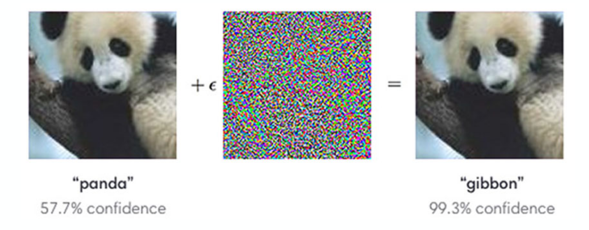
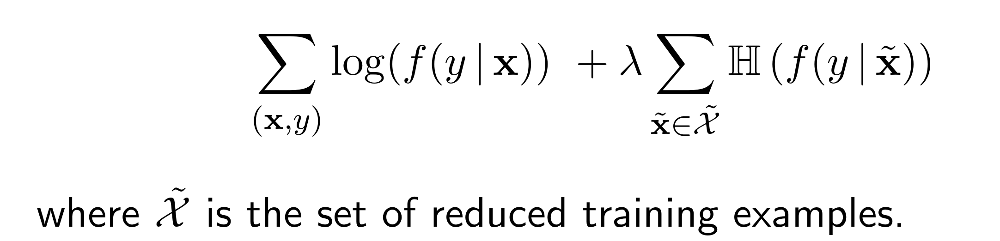
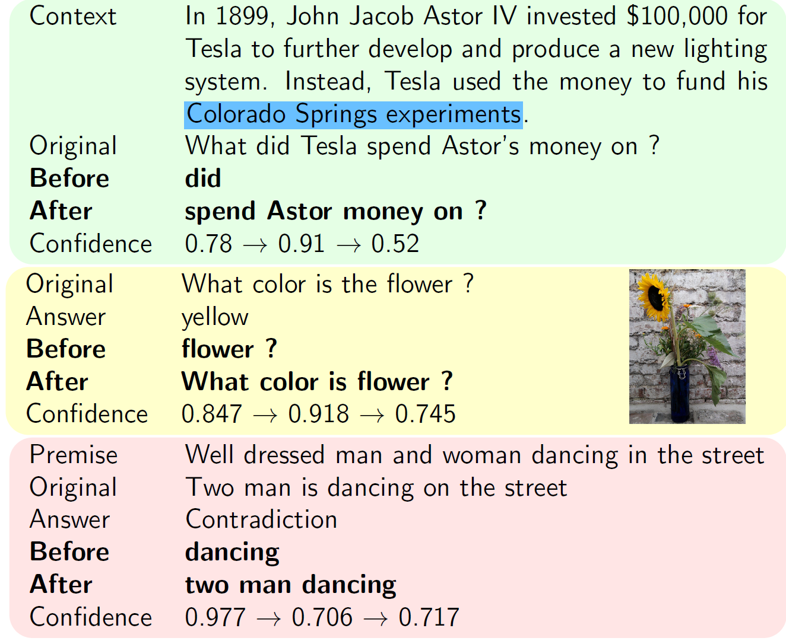
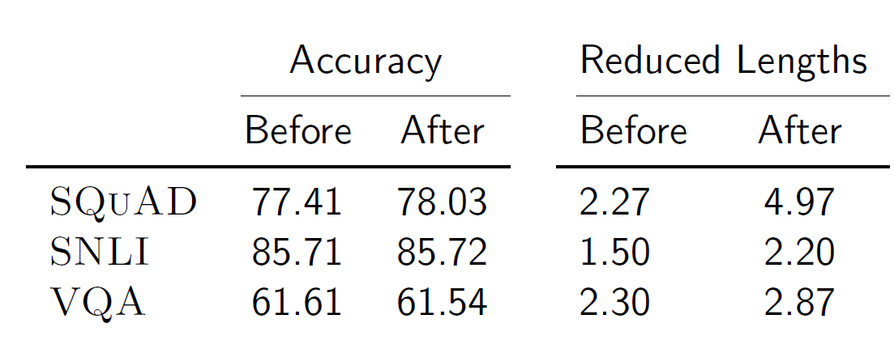
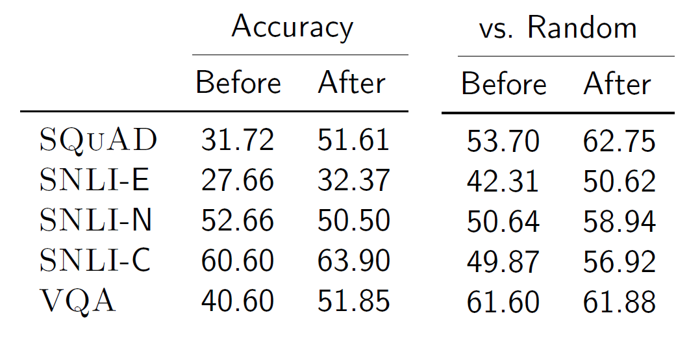
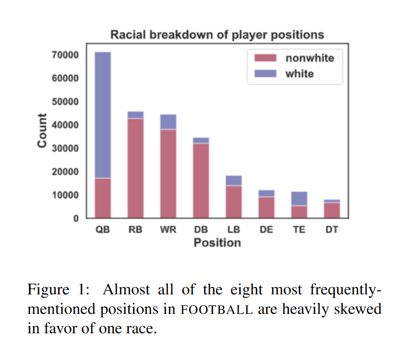
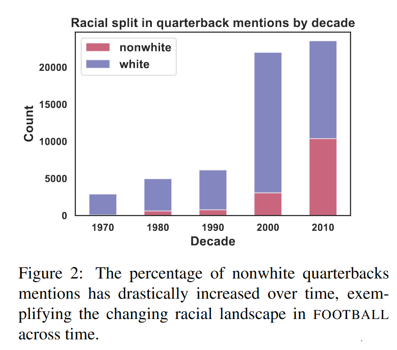
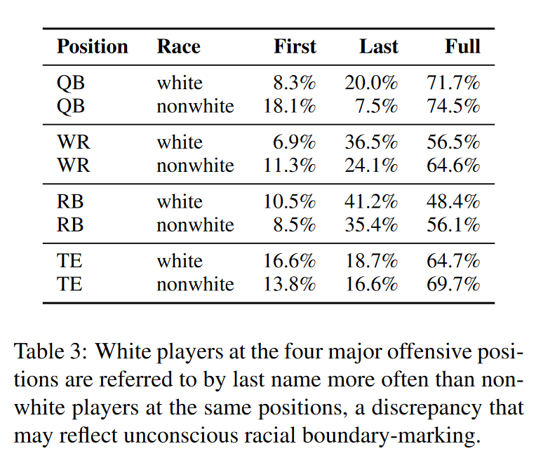
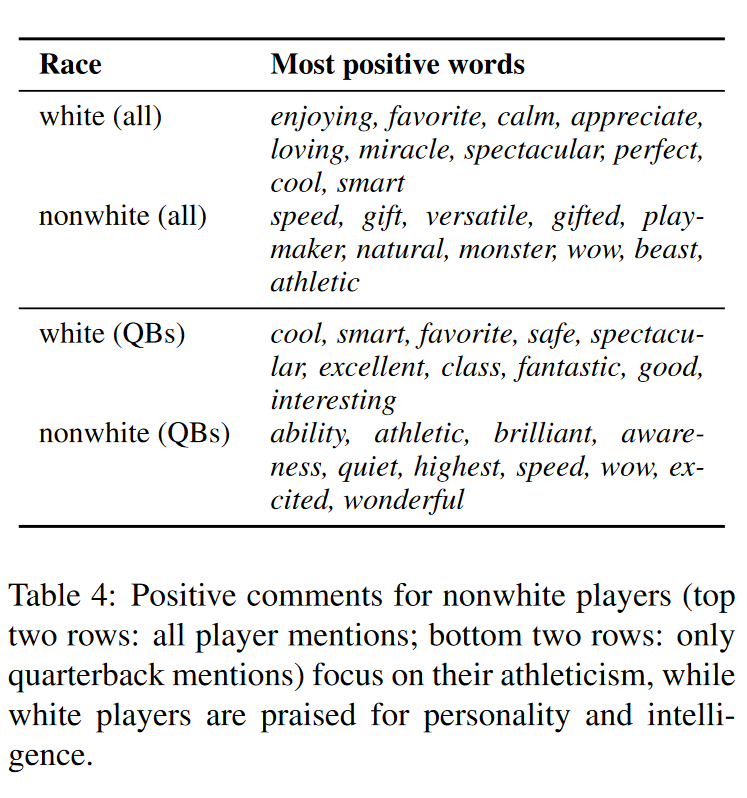

# Introspection: Examining Pathologies in Neural Models and Bias in Sports Commentary

---
# Outline

I will introduce two projects that are "introspective."

* Pathologies of Neural Models Make Interpretations Difficult
* Examining Bias in Sports Commentary with a Large Corpus

---

- Nueral networks produce strong models for many language tasks.
- But are they doing the "right" things?

---
# Pathologies of Neural Models Make Interpretations Difficult

Shi Feng (University of Marland)
Eric Wallace (University of Maryland)
**Alvin Grissom II (Haverford College)**
Mohit Iyyer (University of Maryland)
Pedro Rodriguez (University of Maryland)
Jordan Boy-Graber (University of Maryland)

---

# Model Overconfidence
- Well-documented adversarial attacks in computer vision (Goodfellow et al., 2014)

 
__

Goodfellow, Ian J., Jonathon Shlens, and Christian Szegedy. "Explaining and harnessing adversarial examples." arXiv preprint arXiv:1412.6572 (2014).

---
# Model Overconfidence
- What happens if we remove the *unimportant* words without changing the prediction? (Feng et al., 2018)

__
Shi Feng, Eric Wallace, Alvin Grissom II, Mohit Iyyer, Pedro Rodriguez, Jordan Boyd-Graber "Pathologies of neural models make interpretations difficult." EMNLP (2018).

  
---

# Model Overconfidence
- What happens if we remove the *unimportant* words without changing the prediction? (Feng et al., 2018)

__
  
---

---
# All Examples Drastically Reduced
- Run prediction on entire validation set.
- Keep prediction the same.
- We can consistently reduce examples to very short lengths without changing the prediction.

---

 Confidence remains high on reduced examples.

 
 
---

# Humans Confused by Reduced Inputs
 

---

# How did this happen?

 

- After first reduction step, already rubbish, but confidence remains high.
- Confidence is **not** the same as uncertainty.

---
# How did this happen?

- Implicit bag-of-words assumption.

---

# Mitigation
- Can this be mitigated?
   * Yes! Modify objective function to co-optimize for high entropy on reduced examples.
   * Ideally, we want a model to say "I don't know" when it doesn't know (uniform distribution of confidences)
   

---
   

---

- Accuracy maintained with new model.

---

---

- Input reduction leads to more meaningful examples after regularization.
---

# Summary
- Neural models are overconfident, making interpretations difficult.
    * Poor uncertainty estimates from training.
    * Entropy regularization helps to mitigate.
    
---

# Investigating Sports Commentator Bias within a Large Corpus of American Football Broadcasts

Jack Merullo*
 Luke Yeh*
Abram Handler*
**Alvin Grissom II+**
 Brendan O’Connor*
 Mohit Iyyer*

\*University of Massachussetts--Amherst
\+Haverford College

---
# Background
- Sports commentators inject extemporaneous commentary into on-field sports action.
- Prior social science research has examined racially coded language.

---

# Findings from Previous Work
- Non-white players are less frequently praised for good play. (Ranville and McCormick, 1977)
 - White players often credited with "intelligence." (Bruce, 2004; Billings, 2004)
 - Shortcoming: Previous work used small sample sizes, e.g., Rainville and McCormick (1977) used 16 games and manual coding.

---

# Our Contribution

- Revisit earlier work with large-scaled computational analysis.
- Collect broadcast American football transcripts from YouTube, identify player mentions, and link mentions to metadata about player's race and position.
- Create FOOTBALL dataset

---

# FOOTBALL Dataset
- First large-scale sports commentary corpus annotated wth player race.
- Over 1,455 NCAA game broadcasts, 2960-2019.
- Mentions of players identified and linked to metadata about race and position.
- ~267,778 player mentions of 4,668 unique players.
    * Two confounds
        1. racial composition of many play positions is skewed (e.g., 5% of running backsa are white)
        2. Many mentions of players describe only their actions on the field, not their attributes.

--- 

# Data Processing
- Download automatically captioned YouTube videos of games from archival channels (601 NFL games, 854 NCAA games).
- Identify teams playing gmae and game's year by exact string matching in video title and manually labeling videos with underspecified titles.
- Tokenize with spaCy.
- Get part-of-speech tages with ARK TweetNLP (Owoputi et al., 2013).
-Use phrasemachine (Handler et al., 2016) to identify noun phrases.
- Link exact string maches of first, last, and full names to roster information in online archives.

---

# Identifying Player Race
- We focus on race **perceptions**, as race is a social phenomenon, not a biological one.
- We identify each player as white or non-white.
- Publicly available rosters do not contain race information, so we crowdsource judgments on race.
    * We show crowd workers the player name and a photo from 2,720 images of professional player headshots. 
    * 5 judgments per photo, for 2,720 images
    * All 5 workers agree on 93% of players.
    * Authors manually examined an additional 1,948 players from Google Image search.

---

 # Dataset Analysis

    - We collect statistics on contextual terms in windows of five tokens around each player mention, following Ananya et al. (2019) for gender mention analysis.
    - Challenge: many sentences are descriptive, and descriptions can differ by position, which is skewed by race.
        * e.g., "Copper is a scrappy receiver", "passes the ball down the field"
  
  
---
# Naming and Sentiment Patterns
 - We sidestep confounds in our experiments on **naming patterns** and **sentiment patterns**.
 - **Naming patterns** are how sports commentators refer to players by name (e.g., first or last name).
     * Women are more often referred to by their first names in several sports (Koivula, 1999).
     * White players more often referred to as last names in basketball games (Bruce, 2004).
- Non-white players are praised more for physical attributes than mental ones (Rada, 1996).
- **Sentiment patterns** examine positive or negative sentiment about a player.

--- 
# Naming Patterns
  We corroborate previous studies suggesting white players are more often referred to by last names for several positions.

---

# Sentiment Patterns

- We use domain-specific sentiment lexicon (Hamilton et al., 2006)
    * Search within a context window around player mention for words in lexicon.
    * We find 49,787 windows containing sentiment words, 12.8% of which are negative, which is similar to the 8.3% found by Rada (1996).
- Rank most positive words by using ratio of relative frequencies.

---

# Sentiment Patterns
 Qualitative inspection of list comports with previous research suggesting that nonwhite players more often praised for physical attributes while white players praised for personality and intelligence.

---

# Limitations

- Small lexicon of results.
- Some false positives, e.g., "beast mode" is a nickname for a specific player.

# Key Conclusions

- First such study on this scale.
- Longitudinal analysis of racialized terms in American football.
- Confirms previous results in social science literature.
- FOOTBALL Dataset available for anyone to use.
