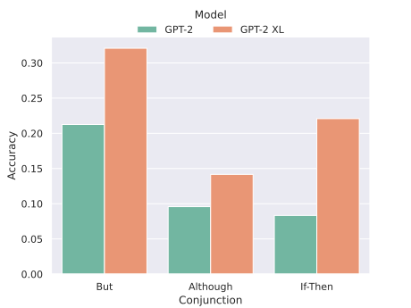

# Probing large language models for focus identification in negated sentences with and without explicit modality
Caroline Gihlstorf and Alvin Grissom II


---
# Outline
- Motivation
- Background
    - Negation
    - Focus
    - Logic
- Prior Work
- Experiments and Results
    - Prompt Generation
    - Quantitative and Qualitative Analysis

---
This is work with my former student Carolin Gihlstorf.
- Now a Ph.D. student in NLP at the University of Virginia


---
# Motivation
- Despite rapid progress in LLMs, they still sometimes dstruggle to fully capture negation and semantic compositionality (Hossain et al. 2020; Tang et al. 2021).
- The degree to which LLMs can use pragmatic information is not well understood.

---
# Negation
- Negation reverses the polarity of a sentence's constituent.
    - has been a problem in NLP since NLP ahs existed

---
# Negation
- Negation reverses the polarity of a sentence's constituent.
    - has been a problem in NLP since NLP ahs existed

---
# Focus
- Humanns handle ambiguity of spoken and written language
    -part of this is by incorporating *focus*.
- Example: Alex likes baseball.

---
# Focus
- Humans handle ambiguity of spoken and written language
    -part of this is by incorporating *focus*.
- Example: Alex likes baseball.
        - **Alex** likes baseball.
        - Alex **likes** baseball.
        - Alex likes **baseball**.

---
# Focus
- Humans effortlessly understand the meaning and implications of each of these, but do LLMs incorporate it in line with human expectations?
- Prgamatics of language (especially intext) not easy to evaluate at scale.
    - We use hand-crafted examples.
    - Formalize truth conditions of expressions in modal logic.

---
# First-order Logic
- Propositional logic goes back to at least Aristotle.
- FOL takes propositional logic (and, or, not, and implication) and adds existential and universal quantifiers.
- Ex: Mary likes someone
$$
\def\textsc#1{\dosc#1\csod} \def\dosc#1#2\csod{{\rm #1{\small #2}}} 
\exists m \exists p[\textsc{MARY}(m) \land \textsc{LIKES}(m,p) \land \textsc{PERSON}(p)]
$$

---
# Second-order Logics
- Adds quantification over predicates, e.g. $\exists P$.
- Ex: Alex does something.
$$
\def\textsc#1{\dosc#1\csod} \def\dosc#1#2\csod{{\rm #1{\small #2}}} 
\exists a \exists P[\textsc{ALEX}(a) \land P(a)]
$$

---
# Modal Logic
- We use modal logic with quantification over predicates to formalize our prompts.
- Modal logic has a long history in semantics and philosophy for specifying and analyzing language.
- Introduces **necessity** $\square$ and possibility $\Diamond$ operators.
- It is necessary that $P$
$$
\square P
$$
- It is possible that $P$
$$
\Diamond P
$$
- Can be further deliniated into categories such as **deontic** and **epistemic**.

---
# Modal Logic
- Used to analyze modals (e.g., *can*, *must), verbs (e.g., *need*), adverbs (e.g., *probably*, definitely), , etc.

- There's also *covert* mobality (Bhatt, 2006), introduced implicitly without explicit words.

---
# Some prior work LLM Reasoning (or "Reasoning"?)
- Controverial
- Han et al. (2022) claims GPT-3 slightly better than random baseline at few-shot learning this on a FOL-annotated dataset.
- Saparov et al. (2023) examing out-of-distribution deductive reasoning; argue GPT-3 can generalize multi-step proofs.
- Kassner and Shutze (2018) look at negated sentences and linguistic priminng of LLMs.

---
# Prior work on Focus and Negation
- Pretty niche
- Modality/negation annotation/tagging in MT (Baker et al., 2012)
- Modality in usuing polarity in facuality detection (sauri and Pustejovsky, 2012)
- Predict focus of negated sentences with BiLSTM+CRF using ELMO embeddings (Hossain et al., 2020)
- Identify focus of negation based on prior context (Rosenberg and Bergler, 2012, Matsuyoshi et al., 2014; Zou et al., 2014, 2015; Shen et al., 2019)

---
# Our work
- Our work tries to get base LLM to play a the "pragmatic game" with us.
- We're not trying to train LLMs to do logical reasoning.
- We're using logic to formalize our prompts and what the LLM does in response.

---
# Focus-mediated Truth Conditions

 - Experimental setup: present base LLM a prompt and see how it finishes the prompt.
    - Does it comport with what we'd expect a human to do?

---
# Focus-mediated Truth Conditions

 - Experimental setup: present base LLM a prompt and see how it finishes the prompt.
    - Does it comport with what we'd expect a human to do?

---
# Focus-mediated Truth Conditions
- In this example, base truth conditions maintained but new ones introduced.


---
#### Focus-mediated Truth Conditions

- 1a: possible existence of someone else who *does* like Mary.
    - reverses original negation of predicate *like* when applied to $p$ and Mary.
- 1b: equivalent to unmarked utterance
- 1c: requires possible existence of uknown predicate $P$ that applies to John and Mary (e.g., *love*)
    - may subsume or contradict original predicate
- 1d: May be some other $p$ whom John does like
    - cancels negation of John and $p$

---
# Focus-mediated Truth Conditions
- Remember: in this example, base truth conditions maintained but new ones introduced.
- Call the additional truth conditions imposed by the marked utterance proposition $F$.
- Key insight:  While one cannot know the precise truth conditions $Q$ without more context, the felicitous $Q$ must be consistent with $F$.
    - Note that hypotehtical additional context may remove the need for the $\Diamond$ expressions.

---
# Experiments
- Goal: characterize behavior of GPT-2 and Flan-T5.
- Prompt each LLM with **prior context** followed by one of three leading "conjunctions".
    - but, although, if-then construction
    - let the model finish with the most probable completion
    - truth or falsity depends only on given prompt, not world knowledge

---
# Experiments

- Three parts:
    - prior context: *Sam plays something.*
    - negated sentence: *Sam doesn't play baseball, *
    - conjunction: "but"

---
# Experiments: Generating Negated Sentences
- Each sentence in form:
```
[subject] + [negation] + [option object]
```
- All nouns are singular.
- Subject randomly chosen form list of fifteen names, 12 generated from a diversenamegenerator.com.
    - remaining three manually added, gender-neutral
- Concatenate random negation construction (*doesn't, does not, didn't*)
- Finally add verb; if transitive, add object.

---
# Experiments: Generating Negated Sentences

- Objects for transitive verbs fall into five categories: sports/games, instruments, school subjects, food, people
- We restrict possible objects to verbs for which they're sensical.
    e.g., *eat* cannot take objects from *sports and games*.
- All verbs are one word to avoid negation scope ambiguity over NPs.
    - e.g., "not **warm** bread"
$$
\def\textsc#1{\dosc#1\csod} \def\dosc#1#2\csod{{\rm #1{\small #2}}} 
\exists x[\neg\textsc{WARM}(x) \land \textsc{BREAD}(x)$) 
$$
vs.   "not warm **bread**"
$$
\def\textsc#1{\dosc#1\csod} \def\dosc#1#2\csod{{\rm #1{\small #2}}} 
\exists x[\textsc{WARM}(x)\land \neg\textsc{BREAD}(x)]
$$

---
# Experiments: Generating Prior Context
- Context establishes (coerces) focus of the following sentence.
```
[subject] + [negation] + [intransitive verb]
```


- Two kinds of context (3a and 3b).
    - followed by conjunction


---
# Experiments: Generating Prior Context


---
# Experiments: Generating Prior Context

The introduction of the named entity Una with the same predicate in 4b is felicitous when the focus in 4a was **someone**


---
# Explicitly Modal Contexts
- Adding explicit modality can strengthen or weaken the coercion.
    - Mary might eat something (weaker priming)
    - Mary must eat something (stronger priming)


---
# Explicit Modal Contexts
- Ex: *It is necessary that someone reads. Und doens't read, but*
    - establishes not only that Una doesn't red
    - also establishes that someone *logically* must read.
    - insists that the model infer who that person is

---
# Explicit Modal Contets
```
[subject/someone] + [verb]/(did/does) something + [optional object]
```
```
[prior context] + [negated sentence] + but

[prior context] + [negated sentence] + although

[prior context] + If + [negated sentence] + then
```
- five types of context incorporating modality

- encourages model to find logical alternative to prompt
- We elide the deontic sense of *should*; traditionally analyzed as epistemic

---
# Results
- Test on GPT-2 and Flan-T5
- We manually inspect each of the 720 sentences completions.
- "Accuracy" is the proportion of completions that indicate the focus was correctly identifies.
- Calculate baseline based on probability of random guess being accurate (based on number of words on which negation can focus)
    - different for transitive and intransitive
$$
\begin{align*}
P(\text{correct}) &= P(\text{correct}, \text{intrans}) + P(\text{correct}, \text{trans}) \\
&= P(\text{intrans}) P(\text{correct}|\text{intrans}) + P(\text{trans}) P(\text{correct}|\text{trans}) \\
&= \frac{1}{2} \times \frac{1}{3} 
    + \frac{1}{2} \times \frac{1}{4}  = 0.292.
\end{align*}
$$

---
# Transitive vs. Intransitive Results (GPT-2)

- Smaller models do worse than random due to nonsequitur outputs.
- Larger models do slightly better than random (0.292)

---
# Transitive vs. Intransitive Results (Flan-T5)

- Smaller models do worse than random due to nonsequitur outputs.
- Larger models do slightly better than random (0.292)

---
# Prior Context Results (GPT-2)
- Modal priming makes a huge difference.
- GPT-2 still worse than random.


---
# Prior Context Results (Flan-T5)
- Modal priming makes a huge difference.
- Flan-T5 XXL does much better than random and GPT-2.


---
# Conjunction Results (GPT-2)


---
# Conjunction Results (Flan-T5)


---
# Observations
- No model achieved accuracy grater than 0.4 on the transitive/untransitive cases.
- LLM probability calculations perhaps not modeling this well.
- Three overlapping failure modes
    - wrong focus
    - logically contradictory outputs
    - nonsequiturs w.r.t. prompt
- First two: model tries to play the game and fails
- Lost one: model refuses to play the game

---
# Observations
- Worse performance on transitive examples might suggest trouble keeping track of verb-object relationship.
- Sentences ending with *but*  might just appear more often in the corpus.
    - maybe *although* just offers a weaker or more vague contrast signal
- This is zero-shot, open-ended completion.
    - We're not claiming the models are doing semantic reasoning, but there are clear differences in performance on task.

---
# Correct Examples


---
# Correct Examples


---
# Correct Examples


---
# Contradictory Examples


---
# Ambiguous Examples


---
# Nonsequitur Examples


---
# Limitations
- Sometimes LLM focused on a constituent not specified in the prompt.
- Sometimes LLM appeared to ignore prior context.
- Sometimes output contained two separate sentences
    - one contradicted the prompt; the other correctly inferred the focus